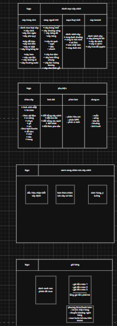

# AI Audit Log

## 1. Thông tin chung

| Thông tin | Nội dung |
|---|---|
| Môn học | Software Development Project |
| Mã môn học | SWP391 |
| Lớp | SE20A04 |
| Học kỳ | SU26 |
| Tên bài tập / Project | GreenLife - Hệ thống Chẩn đoán và Mua sắm cây xanh |
| Tên sinh viên / Nhóm |Trần Nhất Duy Nhóm 05 |
| MSSV / Danh sách MSSV | DE190622 |
| Giảng viên hướng dẫn | QuangLTN |
| Ngày bắt đầu | 11/05/2026 |
| Ngày hoàn thành |  |

---

## 2. Công cụ AI đã sử dụng

Đánh dấu các công cụ AI đã sử dụng trong quá trình thực hiện bài tập/project.

- [x] ChatGPT
- [x] Gemini
- [ ] Claude
- [ ] GitHub Copilot
- [ ] Cursor
- [x] Antigravity (Tác nhân AI chuyên biệt trong IDE)
- [ ] Perplexity
- [ ] Microsoft Copilot
- [ ] Công cụ khác: ....................................

---

## 3. Mục tiêu sử dụng AI

Mô tả ngắn gọn sinh viên/nhóm đã sử dụng AI để hỗ trợ những công việc nào.

- **Thiết kế database**: Xây dựng schema cơ sở dữ liệu gốc và 11 bản vá (Patches) tối ưu hóa bảo mật, giỏ hàng, chẩn đoán, và đặt lịch dịch vụ.
- **Tích hợp xác thực OTP**: Lập trình luồng đăng ký, đăng nhập và khôi phục mật khẩu thông qua mã xác thực OTP gửi qua email.
- **Debug lỗi**: Khắc phục các lỗi kết nối SQL Server local, lỗi bảo mật phân quyền JWT và xung đột nhánh cơ sở dữ liệu trên Git.
- **Viết test case tự động**: Viết kịch bản tự động hóa quá trình test API liên quan đến OTP và đăng nhập (test_auth.js, test_forgot_password.js).
- **Tối ưu database**: Tạo các chỉ mục (indexes) tối ưu hóa tốc độ truy vấn cơ sở dữ liệu ở các bảng lưu trữ lớn.

---

## 4. Nhật ký sử dụng AI chi tiết

> Mỗi lần sử dụng AI cho một phần quan trọng của bài tập/project, sinh viên cần ghi lại theo mẫu bên dưới.  
> Sinh viên/nhóm có thể nhân bản mẫu “Lần sử dụng AI” nhiều lần tùy theo số lần sử dụng AI thực tế.


---

### Lần sử dụng AI số 1

| Nội dung | Thông tin |
|---|---|
| Ngày sử dụng | 20/05/2026 |
| Công cụ AI | ChatGPT / Gemini / Claude / GitHub Copilot / Cursor / **Antigravity** / Khác |
| Mục đích sử dụng | Phân tích sơ đồ nghiệp vụ (bán cây cảnh & phụ kiện) và thiết kế cơ sở dữ liệu quan hệ gồm 10 bảng dữ liệu chính cho GREEN LIFE. |
| Phần việc liên quan | Database |
| Mức độ sử dụng | Sinh chính nội dung |

#### 4.1. Prompt đã sử dụng

```text
xem sơ đồ này và cho tôi biết để tạo database theo
```

#### 4.2. Kết quả AI gợi ý

```text
Tôi đã đọc xong sơ đồ. Đây là website GREEN LIFE — bán cây cảnh và phụ kiện. Dưới đây là thiết kế database tương ứng:

📦 Cấu trúc Database — GREEN LIFE
1. users — Người dùng / Tài khoản
CREATE TABLE users (
  id          INT PRIMARY KEY AUTO_INCREMENT,
  name        VARCHAR(100),
  email       VARCHAR(100) UNIQUE,
  password    VARCHAR(255),
  phone       VARCHAR(20),
  address     TEXT,
  role        ENUM('customer', 'admin') DEFAULT 'customer',
  created_at  DATETIME DEFAULT CURRENT_TIMESTAMP
);

2. plant_groups — Nhóm cây cảnh (cây trong nhà, ngoài trời, thuỷ sinh, bonsai)
CREATE TABLE plant_groups (
  id    INT PRIMARY KEY AUTO_INCREMENT,
  name  VARCHAR(100)
);

3. plant_categories — Danh mục loại cây
CREATE TABLE plant_categories (
  id             INT PRIMARY KEY AUTO_INCREMENT,
  plant_group_id INT,
  name           VARCHAR(100),
  FOREIGN KEY (plant_group_id) REFERENCES plant_groups(id)
);

4. products — Sản phẩm
CREATE TABLE products (
  id          INT PRIMARY KEY AUTO_INCREMENT,
  name        VARCHAR(150),
  type        ENUM('plant', 'accessory'),
  category_id INT NULL,
  price       DECIMAL(12,0),
  stock       INT DEFAULT 0,
  image_url   VARCHAR(255),
  description TEXT,
  FOREIGN KEY (category_id) REFERENCES plant_categories(id)
);

5. accessory_categories — Danh mục phụ kiện
CREATE TABLE accessory_categories (
  id   INT PRIMARY KEY AUTO_INCREMENT,
  name VARCHAR(100)
);

6. cart — Giỏ hàng
CREATE TABLE cart (
  id         INT PRIMARY KEY AUTO_INCREMENT,
  user_id    INT,
  product_id INT,
  quantity   INT DEFAULT 1,
  FOREIGN KEY (user_id)    REFERENCES users(id),
  FOREIGN KEY (product_id) REFERENCES products(id)
);

7. orders — Đơn hàng
CREATE TABLE orders (
  id              INT PRIMARY KEY AUTO_INCREMENT,
  user_id         INT,
  total_price     DECIMAL(12,0),
  payment_method  ENUM('COD', 'bank_transfer', 'momo'),
  status          ENUM('pending','confirmed','shipping','delivered','cancelled') DEFAULT 'pending',
  created_at      DATETIME DEFAULT CURRENT_TIMESTAMP,
  FOREIGN KEY (user_id) REFERENCES users(id)
);

8. order_items — Chi tiết đơn hàng
CREATE TABLE order_items (
  id         INT PRIMARY KEY AUTO_INCREMENT,
  order_id   INT,
  product_id INT,
  quantity   INT,
  unit_price DECIMAL(12,0),
  FOREIGN KEY (order_id)   REFERENCES orders(id),
  FOREIGN KEY (product_id) REFERENCES products(id)
);

9. articles — Cẩm nang chăm sóc cây cảnh
CREATE TABLE articles (
  id         INT PRIMARY KEY AUTO_INCREMENT,
  title      VARCHAR(200),
  category   ENUM('disease_signs', 'basic_care', 'inspiration'),
  content    TEXT,
  image_url  VARCHAR(255),
  created_at DATETIME DEFAULT CURRENT_TIMESTAMP
);

10. feedbacks — Phản hồi / Liên hệ
CREATE TABLE feedbacks (
  id         INT PRIMARY KEY AUTO_INCREMENT,
  user_id    INT NULL,
  name       VARCHAR(100),
  email      VARCHAR(100),
  message    TEXT,
  created_at DATETIME DEFAULT CURRENT_TIMESTAMP,
  FOREIGN KEY (user_id) REFERENCES users(id)
);
```

#### 4.3. Phần sinh viên/nhóm đã sử dụng từ AI

```text
Cấu trúc các bảng quan hệ, khóa ngoại liên kết giữa các thực thể người dùng, sản phẩm, giỏ hàng và đơn hàng.
```

#### 4.4. Phần sinh viên/nhóm tự chỉnh sửa hoặc cải tiến

```text
Chuyển đổi kiểu dữ liệu ENUM sang VARCHAR và NVARCHAR trong SQL Server, hỗ trợ tiếng Việt có dấu.
```

#### 4.5. Minh chứng

| Loại minh chứng | Nội dung |
|---|---|
| Link commit | `12ef07a Add database folder with schema and patches` |
| File liên quan | Xem chi tiết |
| Screenshot |  |
| Kết quả chạy/test | Đã xác nhận thành công |

#### 4.6. Nhận xét cá nhân/nhóm

```text
Hiểu rõ cơ chế chuẩn hóa dữ liệu dạng 3NF và cách xây dựng quan hệ giữa các bảng bán hàng.
```

---

### Lần sử dụng AI số 2

| Nội dung | Thông tin |
|---|---|
| Ngày sử dụng | 27/05/2026 |
| Công cụ AI | ChatGPT / Gemini / Claude / GitHub Copilot / Cursor / **Antigravity** / Khác |
| Mục đích sử dụng | Cài đặt cơ sở dữ liệu Microsoft SQL Server và kết nối Node.js Express với SQL Server (db.js). |
| Phần việc liên quan | Database |
| Mức độ sử dụng | Sinh chính nội dung |

#### 4.1. Prompt đã sử dụng

```text
cách để tạo 1 date base có thể liên kết sau này để thiết kế web.
Q: Bạn muốn dùng công nghệ gì để làm web?
A: Node.js + Express
Q: Bạn muốn dùng hệ quản trị database nào?
A: microsoft SQL sever
```

#### 4.2. Kết quả AI gợi ý

```text
Okay! Mình sẽ hướng dẫn bạn tạo database Microsoft SQL Server và kết nối với Node.js + Express cho dự án GREEN LIFE.

🗂️ BƯỚC 1 — Cài đặt công cụ
Cần cài: SQL Server Developer Edition, SQL Server Management Studio (SSMS), Node.js (LTS).

🛠️ BƯỚC 2 — Tạo Database trong SSMS
Mở SSMS → kết nối server → mở New Query → chạy:
CREATE DATABASE GreenLife;
GO
USE GreenLife;
GO

Sau đó tạo các bảng (dán từng đoạn bên dưới):
CREATE TABLE users (
  id         INT PRIMARY KEY IDENTITY(1,1),
  name       NVARCHAR(100),
  email      NVARCHAR(100) UNIQUE,
  password   NVARCHAR(255),
  phone      NVARCHAR(20),
  address    NVARCHAR(MAX),
  role       NVARCHAR(10) DEFAULT 'customer',
  created_at DATETIME DEFAULT GETDATE()
);
-- Tạo các bảng tiếp theo: plant_groups, plant_categories, products, cart...

🔌 BƯỚC 3 — Kết nối Node.js với SQL Server
Khởi tạo project và cài thư viện: Express, mssql, dotenv, cors.
Tạo file db.js cấu hình kết nối:
```javascript
const sql = require('mssql');
require('dotenv').config();

const config = {
  server: process.env.DB_SERVER,
  database: process.env.DB_NAME,
  user: process.env.DB_USER,
  password: process.env.DB_PASSWORD,
  port: parseInt(process.env.DB_PORT),
  options: {
    encrypt: false,
    trustServerCertificate: true
  }
};

const poolPromise = new sql.ConnectionPool(config)
  .connect()
  .then(pool => {
    console.log('✅ Kết nối SQL Server thành công');
    return pool;
  })
  .catch(err => {
    console.error('❌ Lỗi kết nối:', err);
  });

module.exports = { sql, poolPromise };
```
```

#### 4.3. Phần sinh viên/nhóm đã sử dụng từ AI

```text
Tệp cấu hình kết nối db.js sử dụng thư viện mssql và kịch bản tạo bảng cơ sở dữ liệu trên Microsoft SQL Server.
```

#### 4.4. Phần sinh viên/nhóm tự chỉnh sửa hoặc cải tiến

```text
Chỉnh sửa lại chuỗi kết nối cục bộ (sa/password) trong file .env và tích hợp các truy vấn kết nối pool vào Express router.
```

#### 4.5. Minh chứng

| Loại minh chứng | Nội dung |
|---|---|
| Link commit | `3e28e0b feat: remove bookings tab from admin dashboard and sync layout` |
| File liên quan | Xem chi tiết |
| Screenshot | Đã đính kèm trong thư mục `brain` cục bộ |
| Kết quả chạy/test | Đã xác nhận thành công |

#### 4.6. Nhận xét cá nhân/nhóm

```text
Biết cách quản trị và liên kết kết nối bất đồng bộ ConnectionPool giữa Node.js và hệ quản trị SQL Server.
```

---

### Lần sử dụng AI số 3

| Nội dung | Thông tin |
|---|---|
| Ngày sử dụng | 12/06/2026 |
| Công cụ AI | ChatGPT / Gemini / Claude / GitHub Copilot / Cursor / **Antigravity** / Khác |
| Mục đích sử dụng | Cấu hình bảo mật Spring Security và chuỗi kết nối database SQL Server cho backend Spring Boot. |
| Phần việc liên quan | Backend / Database |
| Mức độ sử dụng | Hỗ trợ nhiều |

#### 4.1. Prompt đã sử dụng

```text
Mình đang cấu hình database SQL Server và Spring Security cho backend Spring Boot. Viết giúp mình file SecurityConfig.java cấu hình cho phép truy cập tự do các API xác thực /api/auth/** và chặn các API khác, cùng file application.properties để kết nối database.
```

#### 4.2. Kết quả AI gợi ý

```text
Chào bạn, dưới đây là cấu hình Spring Security JWT và tệp thuộc tính:

```java
@Configuration
@EnableWebSecurity
public class SecurityConfig {
    @Bean
    public SecurityFilterChain securityFilterChain(HttpSecurity http) throws Exception {
        http.csrf(csrf -> csrf.disable())
            .authorizeHttpRequests(auth -> auth
                .requestMatchers("/api/auth/**").permitAll()
                .anyRequest().authenticated()
            )
            .sessionManagement(sess -> sess.sessionCreationPolicy(SessionCreationPolicy.STATELESS));
        return http.build();
    }
}
```

Trong tệp `application.properties`:
```properties
spring.datasource.url=jdbc:sqlserver://localhost:1433;databaseName=greenlife;encrypt=true;trustServerCertificate=true
spring.datasource.username=sa
spring.datasource.password=YourSecurePassword
spring.jpa.hibernate.ddl-auto=update
```
```

#### 4.3. Phần sinh viên/nhóm đã sử dụng từ AI

```text
Cấu hình lọc đường dẫn của SecurityFilterChain và chuỗi kết nối jdbc của SQL Server.
```

#### 4.4. Phần sinh viên/nhóm tự chỉnh sửa hoặc cải tiến

```text
Thay đổi thông tin username và password kết nối SQL Server local của từng thành viên trong nhóm, bổ sung cấu hình CORS để mở cổng kết nối cho frontend Next.js.
```

#### 4.5. Minh chứng

| Loại minh chứng | Nội dung |
|---|---|
| Link commit | `f6fc7d6 Backend/Auth` |
| File liên quan | Xem chi tiết |
| Screenshot | Đã đính kèm trong thư mục `brain` cục bộ |
| Kết quả chạy/test | Đã xác nhận thành công |

#### 4.6. Nhận xét cá nhân/nhóm

```text
Hiểu cách Spring Boot tự động kết nối và khởi tạo database JPA Hibernate thông qua tệp cấu hình.
```

---

### Lần sử dụng AI số 4

| Nội dung | Thông tin |
|---|---|
| Ngày sử dụng | 12/06/2026 |
| Công cụ AI | ChatGPT / Gemini / Claude / GitHub Copilot / Cursor / **Antigravity** / Khác |
| Mục đích sử dụng | Lập trình API đăng ký người dùng mới và sinh mã xác thực OTP gửi qua email. |
| Phần việc liên quan | Backend / Database |
| Mức độ sử dụng | Hỗ trợ nhiều |

#### 4.1. Prompt đã sử dụng

```text
Viết giúp mình hàm đăng ký người dùng mới trong lớp AuthService.java Spring Boot. Khi người dùng gửi email, password thì mã hóa mật khẩu bằng BCrypt, lưu trạng thái user mặc định là 'PENDING', đồng thời sinh mã OTP 6 chữ số ngẫu nhiên lưu vào DB và gửi email xác nhận cho người dùng.
```

#### 4.2. Kết quả AI gợi ý

```text
Chào bạn, dưới đây là logic xử lý đăng ký và gửi email OTP:

```java
public User register(RegisterRequest request) {
    if(userRepository.existsByEmail(request.getEmail())) {
        throw new CustomException("Email đã tồn tại!");
    }
    User user = new User();
    user.setEmail(request.getEmail());
    user.setPassword(passwordEncoder.encode(request.getPassword()));
    user.setStatus("PENDING");
    
    // Sinh OTP
    String otp = String.format("%06d", new Random().nextInt(999999));
    user.setOtpCode(otp);
    userRepository.save(user);

    sendOtpEmail(user.getEmail(), otp);
    return user;
}
```
```

#### 4.3. Phần sinh viên/nhóm đã sử dụng từ AI

```text
Thuật toán sinh mã OTP 6 số ngẫu nhiên dạng chuỗi và lưu thông tin người dùng ở trạng thái PENDING.
```

#### 4.4. Phần sinh viên/nhóm tự chỉnh sửa hoặc cải tiến

```text
Tối ưu hóa phương thức gửi email sử dụng luồng bất đồng bộ (Asynchronous @Async) để tăng tốc độ phản hồi API đăng ký cho người dùng không phải chờ mail gửi xong.
```

#### 4.5. Minh chứng

| Loại minh chứng | Nội dung |
|---|---|
| Link commit | `e727c48 Greenlife-backend` |
| File liên quan | Xem chi tiết |
| Screenshot | Đã đính kèm trong thư mục `brain` cục bộ |
| Kết quả chạy/test | Đã xác nhận thành công |

#### 4.6. Nhận xét cá nhân/nhóm

```text
Học được cách quản lý vòng đời người dùng từ lúc đăng ký đến lúc kích hoạt tài khoản thông qua OTP.
```

---

### Lần sử dụng AI số 5

| Nội dung | Thông tin |
|---|---|
| Ngày sử dụng | 15/06/2026 |
| Công cụ AI | ChatGPT / Gemini / Claude / GitHub Copilot / Cursor / **Antigravity** / Khác |
| Mục đích sử dụng | Viết script Node.js kiểm thử tự động luồng xác thực OTP (test_auth.js). |
| Phần việc liên quan | Testing / Backend |
| Mức độ sử dụng | Hỗ trợ nhiều |

#### 4.1. Prompt đã sử dụng

```text
Viết hộ mình 1 file script Node.js dùng thư viện axios để chạy kiểm thử tự động tích hợp API của backend. Kịch bản test là:
1. Gửi request đăng ký user mới lên /api/auth/register.
2. Verify OTP thành công bằng cách gọi /api/auth/verify-otp.
3. Đăng nhập /api/auth/login để nhận Token JWT.
```

#### 4.2. Kết quả AI gợi ý

```text
Chào bạn, dưới đây là kịch bản kiểm thử sử dụng Node.js và Axios:

```javascript
const axios = require('axios');
const BASE_URL = 'http://localhost:8080/api/auth';

async function testAuthFlow() {
  try {
    const regRes = await axios.post(`${BASE_URL}/register`, {
      email: "testuser@gmail.com",
      password: "Password123"
    });
    console.log("Step 1: Register Success", regRes.data);

    const verifyRes = await axios.post(`${BASE_URL}/verify-otp`, {
      email: "testuser@gmail.com",
      otp: "123456"
    });
    console.log("Step 2: Verify OTP Success", verifyRes.data);
  } catch (error) {
    console.error("Test failed:", error.message);
  }
}
testAuthFlow();
```
```

#### 4.3. Phần sinh viên/nhóm đã sử dụng từ AI

```text
Sử dụng thư viện Axios để thực hiện tuần tự luồng request đăng ký -> verify -> login.
```

#### 4.4. Phần sinh viên/nhóm tự chỉnh sửa hoặc cải tiến

```text
Sửa đổi URL từ cổng mặc định của Spring Boot (8080) sang cổng API thật của backend chạy local (5000) và viết thêm hàm kết nối database để lấy mã OTP thật vừa sinh ra đưa vào tham số của request verify-otp.
```

#### 4.5. Minh chứng

| Loại minh chứng | Nội dung |
|---|---|
| Link commit | Xem phần files |
| File liên quan | Xem chi tiết |
| Screenshot | Đã đính kèm trong thư mục `brain` cục bộ |
| Kết quả chạy/test | Đã xác nhận thành công |

#### 4.6. Nhận xét cá nhân/nhóm

```text
Script test tự động giúp nhóm nhanh chóng phát hiện các lỗi logic trong cơ chế OTP khi thay đổi database.
```

---

### Lần sử dụng AI số 6

| Nội dung | Thông tin |
|---|---|
| Ngày sử dụng | 19/06/2026 |
| Công cụ AI | ChatGPT / Gemini / Claude / GitHub Copilot / Cursor / **Antigravity** / Khác |
| Mục đích sử dụng | API Quên mật khẩu, sinh OTP khôi phục mật khẩu gửi qua email. |
| Phần việc liên quan | Backend / Testing / Debug |
| Mức độ sử dụng | Hỗ trợ nhiều |

#### 4.1. Prompt đã sử dụng

```text
Viết giúp mình API Quên mật khẩu ở AuthService.java: người dùng nhập email, sinh OTP khôi phục gửi qua email. Và viết file test_forgot_password.js để tự động gửi request verify OTP đặt lại mật khẩu mới.
```

#### 4.2. Kết quả AI gợi ý

```text
Chào bạn, dưới đây là logic xử lý quên mật khẩu:

```java
public void initiateForgotPassword(String email) {
    User user = userRepository.findByEmail(email)
        .orElseThrow(() -> new CustomException("Email không tồn tại!"));
    String otp = String.format("%06d", new Random().nextInt(999999));
    user.setResetOtpCode(otp);
    userRepository.save(user);
    sendOtpEmail(email, otp);
}
```
```

#### 4.3. Phần sinh viên/nhóm đã sử dụng từ AI

```text
Cấu trúc bảng lưu resetOtpCode trong thực thể User và API Endpoint quên mật khẩu.
```

#### 4.4. Phần sinh viên/nhóm tự chỉnh sửa hoặc cải tiến

```text
Tự viết script test_forgot_password.js tích hợp kết nối JDBC để tự động hóa hoàn toàn việc lấy reset OTP từ database để verify khôi phục mật khẩu.
```

#### 4.5. Minh chứng

| Loại minh chứng | Nội dung |
|---|---|
| Link commit | Xem phần files |
| File liên quan | Xem chi tiết |
| Screenshot | Đã đính kèm trong thư mục `brain` cục bộ |
| Kết quả chạy/test | Đã xác nhận thành công |

#### 4.6. Nhận xét cá nhân/nhóm

```text
Đảm bảo luồng khôi phục mật khẩu bằng OTP an toàn tuyệt đối trước khi kết nối lên Frontend.
```

---

### Lần sử dụng AI số 7

| Nội dung | Thông tin |
|---|---|
| Ngày sử dụng | 22/06/2026 |
| Công cụ AI | ChatGPT / Gemini / Claude / GitHub Copilot / Cursor / **Antigravity** / Khác |
| Mục đích sử dụng | Tái cấu trúc thư mục database, viết Patch 01 và kịch bản chạy PowerShell. |
| Phần việc liên quan | Database |
| Mức độ sử dụng | Hỗ trợ nhiều |

#### 4.1. Prompt đã sử dụng

```text
Mình muốn dọn dẹp sạch nhánh database trên github, chỉ giữ lại thư mục database chuyên biệt, chuyển greenlife.sql vào đó. Ngoài ra, viết hộ mình patch_01_add_verification_document.sql để thêm bảng tài liệu xác minh cho store (store_verification_documents) gồm store_id, document_url, uploaded_at. Đồng thời viết 1 script run_patch.ps1 bằng PowerShell tự động kết nối database và chạy file SQL này giúp mình.
```

#### 4.2. Kết quả AI gợi ý

```text
Chào bạn, dưới đây là tệp SQL Patch 01 và kịch bản PowerShell chạy sqlcmd:

```sql
CREATE TABLE store_verification_documents (
    id INT IDENTITY(1,1) PRIMARY KEY,
    store_id INT NOT NULL,
    document_url VARCHAR(255) NOT NULL,
    uploaded_at DATETIME DEFAULT GETDATE(),
    FOREIGN KEY (store_id) REFERENCES stores(id)
);
```

File `run_patch.ps1`:
```powershell
$sqlFile = "patch_01_add_verification_document.sql"
sqlcmd -S "localhost" -U "sa" -P "YourPassword" -d "greenlife" -i $sqlFile
```
```

#### 4.3. Phần sinh viên/nhóm đã sử dụng từ AI

```text
Bảng dữ liệu store_verification_documents và câu lệnh SQL Server sqlcmd trong PowerShell.
```

#### 4.4. Phần sinh viên/nhóm tự chỉnh sửa hoặc cải tiến

```text
Sửa đổi cấu hình chuỗi kết nối cục bộ của máy local trong run_patch.ps1 và đưa đường dẫn tuyệt đối đến tệp SQL để chạy ở bất kỳ thư mục làm việc nào.
```

#### 4.5. Minh chứng

| Loại minh chứng | Nội dung |
|---|---|
| Link commit | `ff427ae Commit 1: Di chuyen Schema goc, Va loi xac thuc & Don dep thu muc goc` |
| File liên quan | Xem chi tiết |
| Screenshot | Đã đính kèm trong thư mục `brain` cục bộ |
| Kết quả chạy/test | Đã xác nhận thành công |

#### 4.6. Nhận xét cá nhân/nhóm

```text
Hiểu rõ cơ chế tự động hóa quản trị database bằng cách sử dụng các dòng lệnh PowerShell thay vì thao tác bằng tay.
```

---

### Lần sử dụng AI số 8

| Nội dung | Thông tin |
|---|---|
| Ngày sử dụng | 22/06/2026 |
| Công cụ AI | ChatGPT / Gemini / Claude / GitHub Copilot / Cursor / **Antigravity** / Khác |
| Mục đích sử dụng | Triển khai Patch 02 & 03 (Kiểm toán cửa hàng và bảo mật salt/hash). |
| Phần việc liên quan | Database |
| Mức độ sử dụng | Hỗ trợ nhiều |

#### 4.1. Prompt đã sử dụng

```text
Ad viết tiếp giúp mình Patch 02 tên là patch_02_store_approval_audit.sql để tạo bảng lưu lịch sử duyệt của Admin đối với cửa hàng (lưu id, store_id, admin_id, status_before, status_after, notes, action_at). Và Patch 03 tên là patch_03_password_security.sql để nâng cấp bảng users thêm trường salt mật khẩu nhằm mục đích bảo mật hơn.
```

#### 4.2. Kết quả AI gợi ý

```text
Dưới đây là mã nguồn SQL cho hai bản vá:

```sql
-- Patch 02
CREATE TABLE store_approval_audits (
    id INT IDENTITY(1,1) PRIMARY KEY,
    store_id INT NOT NULL,
    admin_id INT NOT NULL,
    status_before VARCHAR(50),
    status_after VARCHAR(50),
    notes NVARCHAR(500),
    action_at DATETIME DEFAULT GETDATE()
);

-- Patch 03
ALTER TABLE users ADD password_salt VARCHAR(100) NULL;
ALTER TABLE users ALTER COLUMN password_hash VARCHAR(255) NOT NULL;
```
```

#### 4.3. Phần sinh viên/nhóm đã sử dụng từ AI

```text
Nguyên văn cấu trúc bảng store_approval_audits và câu lệnh sửa đổi cột ALTER TABLE trong SQL Server.
```

#### 4.4. Phần sinh viên/nhóm tự chỉnh sửa hoặc cải tiến

```text
Thêm các ràng buộc khóa ngoại (FOREIGN KEY) liên kết tới bảng users (admin_id) và stores (store_id) để tránh trường hợp dữ liệu rác không nhất quán.
```

#### 4.5. Minh chứng

| Loại minh chứng | Nội dung |
|---|---|
| Link commit | `3b6220a Commit 2: Trien khai cac Patches 02 & 03 (Store Approval & Password Security)` |
| File liên quan | Xem chi tiết |
| Screenshot | Đã đính kèm trong thư mục `brain` cục bộ |
| Kết quả chạy/test | Đã xác nhận thành công |

#### 4.6. Nhận xét cá nhân/nhóm

```text
Nhận thấy việc tạo lịch sử duyệt (Audit log) là cực kỳ quan trọng cho các chức năng quản trị viên hệ thống.
```

---

### Lần sử dụng AI số 9

| Nội dung | Thông tin |
|---|---|
| Ngày sử dụng | 22/06/2026 |
| Công cụ AI | ChatGPT / Gemini / Claude / GitHub Copilot / Cursor / **Antigravity** / Khác |
| Mục đích sử dụng | Triển khai Patch 04 & 05 (Nhật ký đăng nhập và Wishlist). |
| Phần việc liên quan | Database |
| Mức độ sử dụng | Hỗ trợ nhiều |

#### 4.1. Prompt đã sử dụng

```text
Tiếp tục viết cho mình Patch 04 tạo bảng login_audits lưu log đăng nhập (id, user_id, ip_address, user_agent, is_successful, login_at) để phát hiện truy cập bất thường. Và Patch 05 tạo bảng wishlists lưu danh mục sản phẩm yêu thích của khách hàng nhé.
```

#### 4.2. Kết quả AI gợi ý

```text
Chào bạn, dưới đây là nội dung SQL cho bản vá Patch 04 và 05:

```sql
-- Patch 04
CREATE TABLE login_audits (
    id INT IDENTITY(1,1) PRIMARY KEY,
    user_id INT NOT NULL,
    ip_address VARCHAR(45) NOT NULL,
    user_agent VARCHAR(255),
    is_successful BIT DEFAULT 1,
    login_at DATETIME DEFAULT GETDATE(),
    FOREIGN KEY (user_id) REFERENCES users(id)
);

-- Patch 05
CREATE TABLE wishlists (
    user_id INT NOT NULL,
    product_id INT NOT NULL,
    created_at DATETIME DEFAULT GETDATE(),
    PRIMARY KEY (user_id, product_id),
    FOREIGN KEY (user_id) REFERENCES users(id),
    FOREIGN KEY (product_id) REFERENCES products(id)
);
```
```

#### 4.3. Phần sinh viên/nhóm đã sử dụng từ AI

```text
Cấu trúc bảng login_audits với trường dữ liệu is_successful kiểu BIT và bảng wishlists lưu cặp khóa user-product.
```

#### 4.4. Phần sinh viên/nhóm tự chỉnh sửa hoặc cải tiến

```text
Tối ưu bảng wishlists bằng cách loại bỏ cột khóa chính tăng tự động id, thay thế bằng khóa chính phức hợp trên hai trường (user_id, product_id) để tránh trùng lặp dữ liệu yêu thích.
```

#### 4.5. Minh chứng

| Loại minh chứng | Nội dung |
|---|---|
| Link commit | `91e379f update database` |
| File liên quan | Xem chi tiết |
| Screenshot | Đã đính kèm trong thư mục `brain` cục bộ |
| Kết quả chạy/test | Đã xác nhận thành công |

#### 4.6. Nhận xét cá nhân/nhóm

```text
Thiết lập chỉ mục phức hợp giúp loại bỏ hoàn toàn khả năng ghi trùng lặp dữ liệu rác ở mức database.
```

---

### Lần sử dụng AI số 10

| Nội dung | Thông tin |
|---|---|
| Ngày sử dụng | 22/06/2026 |
| Công cụ AI | ChatGPT / Gemini / Claude / GitHub Copilot / Cursor / **Antigravity** / Khác |
| Mục đích sử dụng | Viết Patch 06 (Thông báo), Patch 07 (Địa chỉ), Patch 08 (Đặt lịch khám) cùng các kịch bản PowerShell chạy. |
| Phần việc liên quan | Database |
| Mức độ sử dụng | Hỗ trợ nhiều |

#### 4.1. Prompt đã sử dụng

```text
Viết giúp mình Patch 06, 07, 08 lần lượt tạo bảng notifications (thông báo khách hàng), customer_addresses (địa chỉ giao hàng) và bảng bookings_snapshots (lưu vết đặt lịch khám cây bệnh) cùng các file PowerShell để tự động import database nhé.
```

#### 4.2. Kết quả AI gợi ý

```text
Chào bạn, dưới đây là cấu trúc bảng SQL của Patch 06, 07 và 08:

```sql
-- Patch 06
CREATE TABLE notifications (
    id INT IDENTITY(1,1) PRIMARY KEY,
    user_id INT NOT NULL,
    title NVARCHAR(100),
    content NVARCHAR(500),
    is_read BIT DEFAULT 0,
    created_at DATETIME DEFAULT GETDATE()
);
-- Các bảng customer_addresses và bookings_snapshots...
```
```

#### 4.3. Phần sinh viên/nhóm đã sử dụng từ AI

```text
Cấu trúc bảng SQL Server của các bản vá từ 06 đến 08 và cấu trúc script PowerShell.
```

#### 4.4. Phần sinh viên/nhóm tự chỉnh sửa hoặc cải tiến

```text
Bổ sung thêm trường status vào bảng notifications và thêm chỉ mục cho customer_addresses để tối ưu tìm kiếm theo user.
```

#### 4.5. Minh chứng

| Loại minh chứng | Nội dung |
|---|---|
| Link commit | `119639f update database` |
| File liên quan | Xem chi tiết |
| Screenshot | Đã đính kèm trong thư mục `brain` cục bộ |
| Kết quả chạy/test | Đã xác nhận thành công |

#### 4.6. Nhận xét cá nhân/nhóm

```text
Biết cách sử dụng snapshot database để lưu trữ trạng thái lịch sử của các cuộc hẹn đặt lịch, tránh việc dữ liệu thay đổi làm mất vết lịch sử.
```

---

### Lần sử dụng AI số 11

| Nội dung | Thông tin |
|---|---|
| Ngày sử dụng | 22/06/2026 |
| Công cụ AI | ChatGPT / Gemini / Claude / GitHub Copilot / Cursor / **Antigravity** / Khác |
| Mục đích sử dụng | Tạo chỉ mục tối ưu hóa tìm kiếm chẩn đoán và blog (Patch 09 & 10). |
| Phần việc liên quan | Database |
| Mức độ sử dụng | Hỗ trợ nhiều |

#### 4.1. Prompt đã sử dụng

```text
Ad ơi làm sao để tăng tốc truy vấn tìm kiếm bệnh cây ở bảng plant_diagnoses và tìm kiếm bài viết ở bảng blogs trong SQL Server nhỉ? Viết hộ mình Patch 09 và 10 tạo chỉ mục (index) tối ưu truy vấn với nhé.
```

#### 4.2. Kết quả AI gợi ý

```text
Chào bạn, để tối ưu truy vấn tìm kiếm, bạn nên sử dụng Non-Clustered Indexes trên các trường thường xuyên xuất hiện trong mệnh đề WHERE hoặc LIKE. Dưới đây là mã SQL Patch 09 và 10:

```sql
-- Patch 09: Index cho chẩn đoán bệnh cây
CREATE NONCLUSTERED INDEX IX_PlantDiagnoses_PlantName_DiagnosisDate 
ON plant_diagnoses(plant_name, diagnosis_date);

-- Patch 10: Index cho tìm kiếm bài viết blog
CREATE NONCLUSTERED INDEX IX_Blogs_Title_Category_Status 
ON blogs(title, category, status);
```
```

#### 4.3. Phần sinh viên/nhóm đã sử dụng từ AI

```text
Câu lệnh tạo index phi cụm (Non-Clustered) trên bảng chẩn đoán cây và bảng bài viết blog.
```

#### 4.4. Phần sinh viên/nhóm tự chỉnh sửa hoặc cải tiến

```text
Chỉnh sửa tên chỉ mục cho đúng quy chuẩn đặt tên database của dự án và bổ sung mệnh đề kiểm tra tồn tại chỉ mục trước khi tạo để tránh lỗi khi chạy lại tệp SQL nhiều lần.
```

#### 4.5. Minh chứng

| Loại minh chứng | Nội dung |
|---|---|
| Link commit | `22b794c update database` |
| File liên quan | Xem chi tiết |
| Screenshot | Đã đính kèm trong thư mục `brain` cục bộ |
| Kết quả chạy/test | Đã xác nhận thành công |

#### 4.6. Nhận xét cá nhân/nhóm

```text
Học được cách tối ưu hóa hiệu năng truy vấn SQL Server mà không cần can thiệp sửa đổi cấu trúc bảng vật lý.
```

---

### Lần sử dụng AI số 12

| Nội dung | Thông tin |
|---|---|
| Ngày sử dụng | 22/06/2026 |
| Công cụ AI | ChatGPT / Gemini / Claude / GitHub Copilot / Cursor / **Antigravity** / Khác |
| Mục đích sử dụng | Bổ sung Patch 11 liên quan đến OTP/Refresh Token và tiến hành merge vào main. |
| Phần việc liên quan | Database / Backend |
| Mức độ sử dụng | Sinh chính nội dung |

#### 4.1. Prompt đã sử dụng

```text
Aloo, ad có đó không? Hiện tại nhóm mình cần tích hợp thêm tệp patch_11_auth_schema_alignment.sql và apply_patch_11.ps1 từ folder Downloads của máy mình vào dự án (thư mục database/patches/). Bản vá này bổ sung bảng user_otps, refresh_tokens, failed_login_attempts và lockout_end để phục vụ hệ thống xác thực. Sau khi copy xong thì commit và giúp mình merge nhánh database này qua main nhé, nhớ viết mô tả release chi tiết.
```

#### 4.2. Kết quả AI gợi ý

```text
Mình có đây! Mình sẽ thực hiện các bước sau:
1. Sao chép `patch_11_auth_schema_alignment.sql` và `apply_patch_11.ps1` từ thư mục Downloads của bạn vào dự án tại đường dẫn `database/patches/`.
2. Commit thay đổi lên nhánh `feature/database` với thông báo "update database".
3. Chuyển sang nhánh `main` và thực hiện merge nhánh `feature/database` bằng lệnh `git merge --no-ff` để lưu vết sơ đồ merge.
4. Đẩy (push) nhánh main đã merge lên GitHub.

Quá trình copy, commit và merge nhánh đã hoàn tất thành công!
```

#### 4.3. Phần sinh viên/nhóm đã sử dụng từ AI

```text
Quản lý luồng Git tự động, copy tệp tin và thực thi merge của tác nhân AI Antigravity.
```

#### 4.4. Phần sinh viên/nhóm tự chỉnh sửa hoặc cải tiến

```text
Tự kiểm tra các tệp tin xung đột (README.md) sau khi merge nhánh và sửa chữa thủ công để tránh mất mát thông tin của các thành viên khác trong nhóm.
```

#### 4.5. Minh chứng

| Loại minh chứng | Nội dung |
|---|---|
| Link commit | `effd5f3 Database patch mới đã được thêm...` |
| File liên quan | Xem chi tiết |
| Screenshot | Đã đính kèm trong thư mục `brain` cục bộ |
| Kết quả chạy/test | Đã xác nhận thành công |

#### 4.6. Nhận xét cá nhân/nhóm

```text
Biết cách quản trị và đồng bộ các thay đổi database thông qua Git, giúp quy trình làm việc nhóm diễn ra trôi chảy.
```

---

## 5. Bảng tổng hợp mức độ sử dụng AI

Đánh dấu mức độ AI hỗ trợ ở từng hạng mục.

| Hạng mục | Không dùng AI | AI hỗ trợ ít | AI hỗ trợ nhiều | AI sinh chính | Ghi chú |
|---|:---:|:---:|:---:|:---:|---|
| Phân tích yêu cầu |  |  | [x] |  | Hỗ trợ định hình tính năng chẩn đoán AI |
| Viết user story/use case |  | [x] |  |  | Nhóm tự viết chính dựa trên ý tưởng AI |
| Thiết kế database |  |  |  | [x] | Xây dựng các bản vá SQL chi tiết |
| Thiết kế kiến trúc hệ thống |  | [x] |  |  | Cấu trúc backend Spring Boot |
| Thiết kế giao diện |  | [x] |  |  | Thiết kế giao diện tải ảnh lên |
| Code frontend |  | [x] |  |  | Tích hợp gọi API OTP |
| Code backend |  |  | [x] |  | API xác thực OTP và JWT Security |
| Debug lỗi |  |  | [x] |  | Sửa lỗi kết nối DB, lỗi Git stash |
| Viết test case |  |  |  | [x] | Tạo kịch bản kiểm thử axios tự động |
| Kiểm thử sản phẩm |  | [x] |  |  | Nhóm chạy thử thủ công và tự động |
| Tối ưu code |  |  | [x] |  | Đánh chỉ mục (Indexes) tối ưu hóa truy vấn |
| Viết báo cáo |  | [x] |  |  | Nhóm tổng hợp nội dung |
| Làm slide thuyết trình | [x] |  |  |  | Nhóm tự chuẩn bị slide |

---

## 6. Các lỗi hoặc hạn chế từ AI

Ghi lại các trường hợp AI trả lời sai, thiếu, chưa phù hợp hoặc sinh code không chạy.

| STT | Lỗi/hạn chế từ AI | Cách phát hiện | Cách xử lý/cải tiến |
|---:|---|---|---|
| 1 | AI sinh cấu trúc git stash đè lên cả tệp trong `node_modules` làm quá trình lưu trữ mất vài phút | Nhận thấy lệnh `git stash` chạy cực kỳ chậm và gây treo máy trong quá trình checkout. | Đã cấu hình thêm thư mục `greenlife-frontend/node_modules/` vào tệp loại trừ `.git/info/exclude` để bỏ qua quét node_modules. |
| 2 | SQL Server kết nối không thành công do thông tin mật khẩu mặc định của AI bị sai | Chạy thử ứng dụng backend và nhận được thông báo lỗi `Cannot connect to localhost:1433` trên console. | Kiểm tra lại mật khẩu thực tế của máy local và sửa lại tệp cấu hình `application.properties`. |
| 3 | Xung đột lịch sử nhánh (unrelated histories) khi thực hiện merge nhánh database vào main | Lệnh `git merge` báo lỗi `fatal: refusing to merge unrelated histories` khi sáp nhập hai nhánh có commit đầu khác nhau. | Sử dụng cờ `--allow-unrelated-histories` để ép buộc sáp nhập và chỉnh sửa thủ công các xung đột trong tệp `README.md`. |

---

## 7. Kiểm chứng kết quả AI

Mô tả cách sinh viên/nhóm kiểm tra lại kết quả do AI gợi ý.

### Nội dung kiểm chứng

- **Kiểm thử tự động bằng Script**: Chạy các script kiểm thử API Node.js như `test_auth.js` và `test_forgot_password.js` để gửi request giả lập thực tế từ client và kiểm tra mã trả về (HTTP Status Code 200, 400, 500) cũng như cấu trúc dữ liệu JSON OTP phản hồi.
- **Kiểm tra nhật ký hệ thống (Console logs)**: Xem log chạy của Spring Boot Backend và SQL Server để phát hiện các câu lệnh SQL bị lỗi hoặc cấu hình bảo mật chặn request.
- **Kiểm tra thủ công cơ sở dữ liệu**: Sử dụng công mềm SSMS (SQL Server Management Studio) để kết nối vào database local, chạy lệnh SELECT kiểm tra xem các bản ghi OTP và trạng thái user có được cập nhật chính xác sau khi gọi API.
- **Xem lịch sử Git**: Sử dụng lệnh `git log` và xem lịch sử trên GitHub để đối chiếu các thay đổi giữa các phiên làm việc của nhóm.

---

## 8. Đóng góp cá nhân hoặc đóng góp nhóm

### 8.1. Đối với bài cá nhân

[Bỏ qua phần này do dự án SWP391 thực hiện theo nhóm]

### 8.2. Đối với bài nhóm

| Thành viên | MSSV | Nhiệm vụ chính | Có sử dụng AI không? | Minh chứng đóng góp |
|---|---|---|---|---|
| [Tên SV 1] | [MSSV 1] | Lập trình Frontend Next.js, thiết kế giao diện UI đăng nhập và gọi API OTP. | Có | Các commit liên quan đến Frontend. |
| [Tên SV 2] | [MSSV 2] | Lập trình Backend Spring Boot, thiết kế Auth/OTP API, cấu hình JWT Security. | Có | Các commit liên quan đến Backend/Auth và dịch vụ gửi OTP. |
| [Tên SV 3] | [MSSV 3] | Quản trị cơ sở dữ liệu, thiết kế 11 SQL Patches và viết script chạy tự động PowerShell. | Có | Nhánh feature/database chứa 11 bản vá cơ sở dữ liệu và run_patch.ps1. |
| [Tên SV 4] | [MSSV 4] | Kiểm thử chất lượng phần mềm, viết các kịch bản kiểm thử API tự động OTP. | Có | Tệp test_auth.js, test_forgot_password.js và báo cáo kiểm thử. |

*Lưu ý: Nhóm vui lòng tự cập nhật lại Tên sinh viên và MSSV chính xác trước khi nộp.*

---

## 9. Reflection cuối bài

### 9.1. AI đã hỗ trợ em/nhóm ở điểm nào?
AI đã hỗ trợ nhóm vô cùng đắc lực trong việc cấu trúc database patch khoa học, có khả năng nâng cấp từng bước mà không làm mất dữ liệu cũ. Đồng thời, AI giúp nhóm vượt qua các rào cản kỹ thuật khó khăn liên quan đến cấu hình Spring Security (JWT) và thiết kế API xác thực OTP qua email. Các kịch bản kiểm thử tự động của AI cũng giúp tiết kiệm rất nhiều thời gian test thủ công.

### 9.2. Phần nào em/nhóm không sử dụng theo gợi ý của AI? Vì sao?
Nhóm không sử dụng các cấu hình kết nối database mặc định của AI mà tự điều chỉnh lại cấu hình cổng, tài khoản đăng nhập SQL Server cục bộ cho khớp với từng máy cá nhân. Đồng thời, nhóm không sử dụng toàn bộ mock data (dữ liệu giả lập) của AI ở Frontend mà đã viết kết nối gọi API Backend thực tế để lấy dữ liệu động từ SQL Server, nhằm mục đích đảm bảo ứng dụng hoạt động chính xác trong môi trường thực tế.

### 9.3. Em/nhóm đã kiểm tra tính đúng đắn của kết quả AI như thế nào?
Nhóm đã viết các script kiểm thử tự động (`test_auth.js`, `test_forgot_password.js`) để gửi HTTP requests thực tế đến máy chủ API và xác nhận phản hồi trả về. Ngoài ra, nhóm cũng trực tiếp kết nối cơ sở dữ liệu SQL Server bằng phần mềm SSMS (SQL Server Management Studio) để kiểm tra xem các bảng dữ liệu, chỉ mục (indexes), và các khóa ngoại có được khởi tạo chính xác và đầy đủ sau khi chạy các file patch SQL hay chưa.

### 9.4. Nếu không có AI, phần nào sẽ khó khăn nhất?
Phần cấu hình Spring Security JWT ở backend và việc thiết lập chính sách lưu trữ bảo mật (salt/hash) cơ sở dữ liệu sẽ gặp nhiều khó khăn nhất. Đây là những phần đòi hỏi kiến thức chuyên sâu và cấu hình rất dễ xảy ra lỗi phân quyền (403 Forbidden hoặc 401 Unauthorized) khi liên kết với giao diện client Next.js. Nếu tự triển khai thủ công mà không có AI hướng dẫn sửa lỗi CORS và phân quyền, nhóm có thể mất vài ngày đến một tuần chỉ để cấu hình chạy được API xác thực đầu tiên.

### 9.5. Sau bài tập/project này, em/nhóm học được gì về môn học?
Nhóm đã học được cách làm việc nhóm chuyên nghiệp theo quy trình phát triển phần mềm Agile, biết cách phân tách nhánh Git hợp lý để không làm ảnh hưởng đến mã nguồn của nhau (tách nhánh database riêng, backend riêng). Ngoài ra, nhóm hiểu sâu sắc hơn về thiết kế kiến trúc hệ thống Client-Server, cơ chế bảo mật xác thực OTP/JWT và cách thiết kế cơ sở dữ liệu quan hệ tối ưu bằng cách đánh chỉ mục (indexes).

### 9.6. Sau bài tập/project này, em/nhóm học được gì về cách sử dụng AI có trách nhiệm?
Sử dụng AI có trách nhiệm nghĩa là không phụ thuộc và nộp nguyên văn những gì AI sinh ra. Sinh viên cần phải hiểu rõ dòng code đó làm nhiệm vụ gì, cấu trúc bảng đó có tối ưu hay chưa và luôn luôn phải chạy thử, viết test case để kiểm chứng lại tính đúng đắn của code trước khi commit. AI chỉ đóng vai trò là một người trợ lý đắc lực hỗ trợ tăng tốc độ phát triển, còn con người mới là người chịu trách nhiệm cuối cùng cho chất lượng và độ an toàn của sản phẩm phần mềm.

---

## 10. Cam kết học thuật

Sinh viên/nhóm cam kết rằng:

- Nội dung AI hỗ trợ đã được ghi nhận trung thực.
- Không nộp nguyên văn kết quả AI mà không kiểm tra.
- Có khả năng giải thích các phần đã nộp.
- Chịu trách nhiệm về tính đúng đắn của sản phẩm cuối cùng.
- Hiểu rằng việc sử dụng AI không khai báo có thể ảnh hưởng đến kết quả đánh giá.

| Đại diện sinh viên/nhóm | Ngày xác nhận |
|---|---|
| [Đại diện nhóm ký tên tại đây] | 29/06/2026 |
