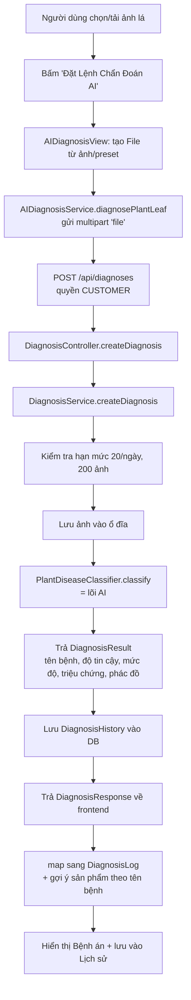
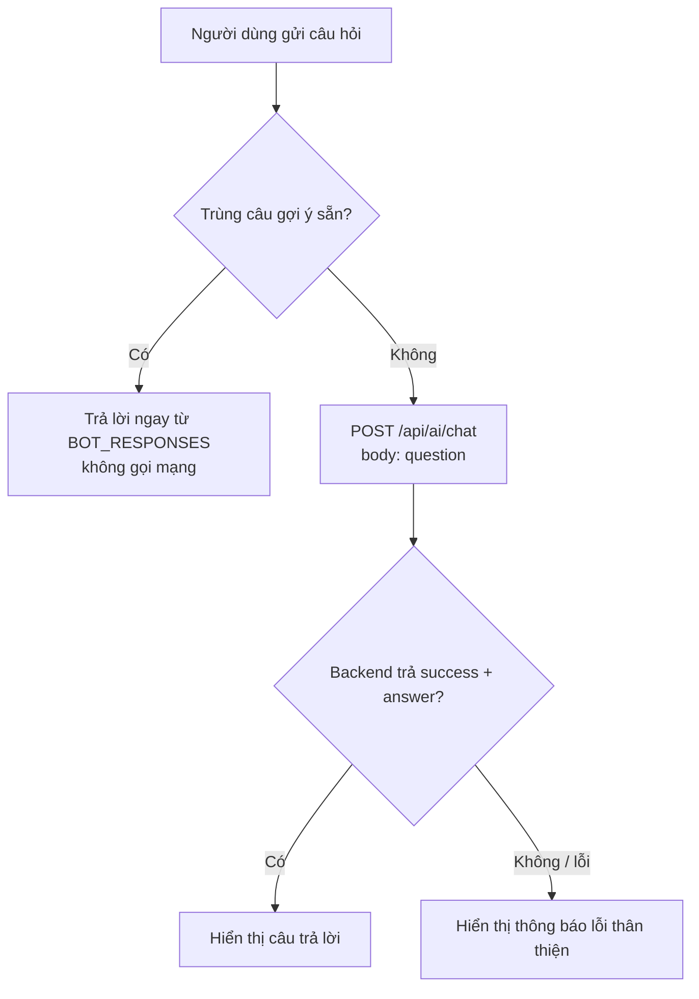

# Hướng Dẫn Tính Năng AI - GreenLife

Tài liệu này dành cho **thành viên trong nhóm** (và người chấm) để hiểu tính năng AI trong dự án GreenLife mà **không cần đọc code**. Nội dung bám sát đúng code hiện tại của repo.

Trong dự án có 2 phần liên quan tới AI:

1. **Bác Sĩ Cây AI (Chẩn đoán bệnh lá cây)** - đang chạy thật, dùng cơ chế mô phỏng (mock) ở tầng phân loại.
2. **Chatbot Trợ lý Cây Trồng** - giao diện đã có, nhưng **đang tắt** và **chưa có backend**.

> Lưu ý trung thực (quan trọng khi bảo vệ đồ án):
> - Tầng "phân loại bệnh" hiện là **mock**: luôn trả về cùng một kết quả (bệnh héo rũ Fusarium, độ tin cậy 94.85%). Xem `MockPlantDiseaseClassifier.java`.
> - Chatbot bị chặn bằng cờ `chatbotBackendSupported = false` nên **không hiển thị** trên giao diện, và endpoint `/api/ai/chat` **chưa được viết** ở backend.
> - Đây là thiết kế "cắm nóng" (pluggable): chỉ cần thay lớp mock bằng AI thật là chạy được, phần còn lại của luồng không đổi.

---

## 1. Cách sử dụng AI

### 1.1. Bác Sĩ Cây AI (chẩn đoán bệnh lá)

Màn hình: `Chẩn Đoán Bệnh Cây AI` (component `AIDiagnosisView.tsx`).

Các bước cho người dùng:

1. Đăng nhập bằng tài khoản có vai trò **CUSTOMER** (bắt buộc, backend yêu cầu quyền này).
2. Vào trang **Chẩn Đoán Bệnh Cây AI**.
3. Cung cấp ảnh lá cây theo 1 trong 2 cách:
   - **Tải ảnh của bạn**: kéo-thả hoặc bấm để chọn file (PNG/JPG, tối đa 10MB).
   - **Chọn mẫu thử nhanh (preset)**: chọn 1 trong các ca bệnh mẫu để trải nghiệm ngay.
4. Bấm **"Đặt Lệnh Chẩn Đoán AI"**.
5. Chờ hệ thống xử lý (có hiệu ứng "đang quét"), sau đó xem **Bệnh án thực vật** gồm:
   - Tên bệnh, đối tượng cây, **mức độ** (nhẹ / trung bình / nặng).
   - **Triệu chứng lâm sàng**.
   - **Phác đồ điều trị** (danh sách các bước).
   - **Sản phẩm sinh học gợi ý** để mua (nếu có).
6. Kết quả được **lưu vào lịch sử** ("Lịch Sử Đã Khám Bệnh"), bấm "Mở lại hồ sơ" để xem lại.

Giới hạn (backend áp dụng - `DiagnosisService.java`):

- Tối đa **20 lượt chẩn đoán / ngày / người dùng**.
- Tối đa **200 ảnh lưu trữ / người dùng**.

### 1.2. Chatbot Trợ lý Cây Trồng

Màn hình: nút tròn nổi góc phải-dưới (component `Chatbot.tsx`).

> Hiện tại chatbot **đang tắt** (`chatbotBackendSupported = false`). Muốn bật để demo, đổi cờ này thành `true`. Khi đó các câu hỏi có sẵn sẽ trả lời được ngay (local), còn câu hỏi tự do sẽ cần backend `/api/ai/chat` (chưa có).

Khi bật, người dùng có thể:

1. Bấm nút trợ lý để mở khung chat.
2. Đọc lời chào mở đầu của bot.
3. Đặt câu hỏi theo 2 cách (xem mục 2).

---

## 2. Cách đặt câu hỏi cho Chatbox

Chatbot nhận câu hỏi theo **2 luồng khác nhau**:

### 2.1. Câu hỏi gợi ý sẵn (Quick Questions)

Có **5 câu hỏi mẫu** hiển thị dạng "pill" để bấm nhanh:

- "Tôi muốn mua cây thì làm sao?"
- "Cách đặt dịch vụ chăm sóc cây?"
- "AI chẩn đoán cây hoạt động thế nào?"
- "Làm sao tìm cửa hàng gần tôi?"
- "Tôi là chủ cửa hàng, đăng ký thế nào?"

Với các câu này, bot trả lời **ngay lập tức bằng nội dung soạn sẵn** (biến `BOT_RESPONSES`), **không gọi mạng**. Đây là dạng "hướng dẫn sử dụng app" đã được viết cứng.

### 2.2. Câu hỏi tự do (gõ tay)

Người dùng gõ câu bất kỳ vào ô nhập rồi bấm gửi:

- Nếu câu gõ **trùng khớp chính xác** một trong 5 câu mẫu → trả lời local như trên.
- Nếu **không trùng** → hệ thống gửi yêu cầu tới backend: `POST /api/ai/chat` với body `{ "question": "<nội dung>" }`, và mong nhận về `{ success: true, answer: "..." }`.

Mẹo đặt câu hỏi hiệu quả (khi backend AI hoạt động):

- Hỏi ngắn gọn, đúng 1 ý (ví dụ: cách mua cây, cách đặt lịch, cách chẩn đoán bệnh).
- Ưu tiên chủ đề trong phạm vi app: mua cây, dịch vụ chăm sóc, chẩn đoán bệnh, tìm cửa hàng, đăng ký chủ shop.
- Nếu bị lỗi mạng/backend, bot trả về câu thông báo lỗi thân thiện thay vì crash.

---

## 3. Cách AI bị "rào" theo form trả lời (guard rails)

Đây là phần quan trọng: **AI không trả lời tự do vô hạn**, mà bị ràng buộc để kết quả luôn đúng cấu trúc và an toàn.

### 3.1. Rào ở Chatbot

- **Rào chủ đề**: 5 câu gợi ý cố định lái người dùng vào đúng phạm vi sản phẩm.
- **Rào nội dung**: các câu mẫu trả lời bằng văn bản soạn sẵn (không để AI tự sinh) → không sai lệch thông tin nghiệp vụ.
- **Rào định dạng**: hàm `renderFormattedText` chỉ hiển thị một tập markdown giới hạn (tiêu đề `#`, gạch đầu dòng, in đậm `**`). Nội dung ngoài các dạng này được hiển thị như văn bản thường.
- **Rào lỗi**: nếu backend trả `success != true` hoặc mất kết nối → hiển thị thông báo lỗi chuẩn, không để lộ chi tiết kỹ thuật.

### 3.2. Rào ở Bác Sĩ Cây AI (mạnh nhất, dạng "schema-locked")

Kết quả AI **buộc phải điền vào một khuôn cố định** là DTO `DiagnosisResult` gồm đúng các trường:

| Trường | Ý nghĩa | Ràng buộc |
|---|---|---|
| `diseaseName` | Tên bệnh | Chuỗi |
| `confidenceScore` | Độ tin cậy | Số (ví dụ 94.85) |
| `severity` | Mức độ | **Chỉ được** `LOW` / `MEDIUM` / `HIGH` / `CRITICAL` (enum `Severity`) |
| `result` | Mô tả triệu chứng | Chuỗi |
| `recommendation` | Phác đồ điều trị | Chuỗi (frontend tách thành từng bước) |

Nhờ khuôn này:

- AI **không thể** trả về dữ liệu ngoài luồng - mọi kết quả đều map được lên giao diện.
- `severity` bị khóa trong enum nên UI luôn tô đúng màu (nhẹ = xanh, trung bình = vàng, nặng = đỏ).
- Frontend tự **chuẩn hoá**: dịch `LOW/MEDIUM/HIGH` sang "nhẹ/trung bình/nặng", tách `recommendation` thành danh sách bước điều trị.

### 3.3. Rào ở tầng bảo mật & hạn mức

- Chỉ **CUSTOMER** mới được tạo chẩn đoán (`@PreAuthorize("hasRole('CUSTOMER')")`).
- Xem chi tiết 1 hồ sơ: chỉ **chủ sở hữu hoặc ADMIN** (chống IDOR).
- Hạn mức 20 lượt/ngày và 200 ảnh/người để chống lạm dụng.
- Chỉ nhận **file ảnh** (frontend kiểm tra `image/*`).

---

## 4. Luồng AI di chuyển như thế nào (end-to-end)

### 4.1. Luồng chẩn đoán bệnh cây

Giải thích ngắn từng chặng:

1. **Frontend thu thập ảnh** (upload thật hoặc preset) và đóng gói thành `FormData` với khóa `file`.
2. **Gửi lên API** `POST /api/diagnoses` (đính kèm token đăng nhập).
3. **Controller** nhận file, xác định người dùng hiện tại, chuyển cho service.
4. **Service** kiểm tra hạn mức → lưu ảnh → **gọi lõi AI** (`PlantDiseaseClassifier`) → nhận kết quả theo khuôn → lưu lịch sử → trả về.
5. **Frontend chuẩn hoá** kết quả, gắn thêm **gợi ý sản phẩm** dựa trên từ khóa tên bệnh, rồi hiển thị.

### 4.2. Luồng Chatbot

---

## 5. Cách AI "tìm ra kết quả" và trả lời

### 5.1. Bác sĩ cây - điểm mấu chốt nằm ở `PlantDiseaseClassifier`

- Đây là **interface** (hợp đồng): nhận `tên file` + `mảng byte ảnh`, trả về `DiagnosisResult`.
- Hiện có **1 hiện thực duy nhất: `MockPlantDiseaseClassifier`** - luôn trả về cùng một kết quả (bệnh héo rũ Fusarium, 94.85%, mức trung bình) bất kể ảnh nào. Mục đích: chạy được toàn bộ luồng và test khi chưa gắn AI thật.
- **Để dùng AI thật**: viết một lớp mới `implements PlantDiseaseClassifier` (ví dụ gọi Gemini/model ảnh), đặt nó thành bean chính. **Không cần sửa** controller, service, frontend - vì đầu ra vẫn theo đúng khuôn `DiagnosisResult`.

Sau khi có kết quả từ lõi AI, "câu trả lời" cho người dùng được tạo bằng cách:

1. Backend map kết quả vào `DiagnosisResponse` và lưu DB.
2. Frontend dịch mức độ, tách phác đồ thành từng bước.
3. Frontend suy ra **gợi ý sản phẩm** bằng luật đơn giản theo tên bệnh:
   - chứa "mốc sương"/"infestans" → gợi ý `prod-5`
   - chứa "sen đá"/"thối" → gợi ý `prod-2`
   - chứa "trĩ"/"hồng" → gợi ý `prod-5`
4. Hiển thị dưới dạng "bệnh án" trực quan.

### 5.2. Chatbot - cách chọn câu trả lời

- **Đối sánh chính xác**: nếu câu hỏi khớp 1 trong 5 câu mẫu → lấy câu trả lời tương ứng đã soạn sẵn.
- **Ngược lại**: đẩy câu hỏi sang backend `/api/ai/chat`, nơi (dự kiến) một mô hình ngôn ngữ sẽ sinh câu trả lời và trả về theo khuôn `{ success, answer }`.
- Frontend chỉ hiển thị trường `answer`; nếu thiếu hoặc lỗi thì hiện thông báo lỗi chuẩn.

---

## 6. Bản đồ file liên quan (để tra cứu nhanh)

| Thành phần | File |
|---|---|
| Giao diện chẩn đoán | `greenlife-frontend/src/components/views/AIDiagnosisView.tsx` |
| Gọi API chẩn đoán | `greenlife-frontend/src/services/aiDiagnosisService.ts` |
| Giao diện chatbot | `greenlife-frontend/src/components/ui/Chatbot.tsx` |
| API chẩn đoán | `greenlife-backend/.../diagnosis/controller/DiagnosisController.java` |
| Logic nghiệp vụ | `greenlife-backend/.../diagnosis/service/DiagnosisService.java` |
| Hợp đồng lõi AI | `greenlife-backend/.../diagnosis/service/PlantDiseaseClassifier.java` |
| Lõi AI (mock) | `greenlife-backend/.../diagnosis/service/MockPlantDiseaseClassifier.java` |
| Khuôn kết quả | `greenlife-backend/.../diagnosis/dto/DiagnosisResult.java` |

---

## 7. Tóm tắt 1 phút (đọc trước khi thuyết trình)

- Có 2 tính năng AI: **chẩn đoán bệnh lá** (chạy thật, lõi đang mock) và **chatbot** (đang tắt, chưa có backend).
- Người dùng **tải ảnh** → hệ thống **kiểm tra hạn mức** → **lưu ảnh** → **lõi AI phân loại** → **trả kết quả theo khuôn cố định** → hiển thị bệnh án + gợi ý sản phẩm.
- AI bị **rào chặt** bằng: khuôn dữ liệu `DiagnosisResult`, enum mức độ, phân quyền CUSTOMER/ADMIN, hạn mức, và (chatbot) danh sách câu hỏi + định dạng hiển thị giới hạn.
- Muốn nâng cấp lên AI thật: chỉ cần **thay lớp mock** bằng lớp gọi model thật, phần còn lại giữ nguyên.
