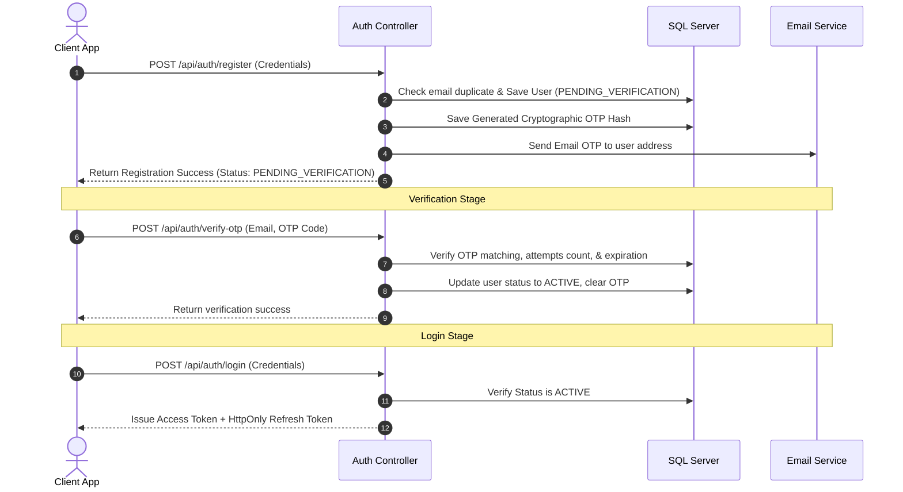
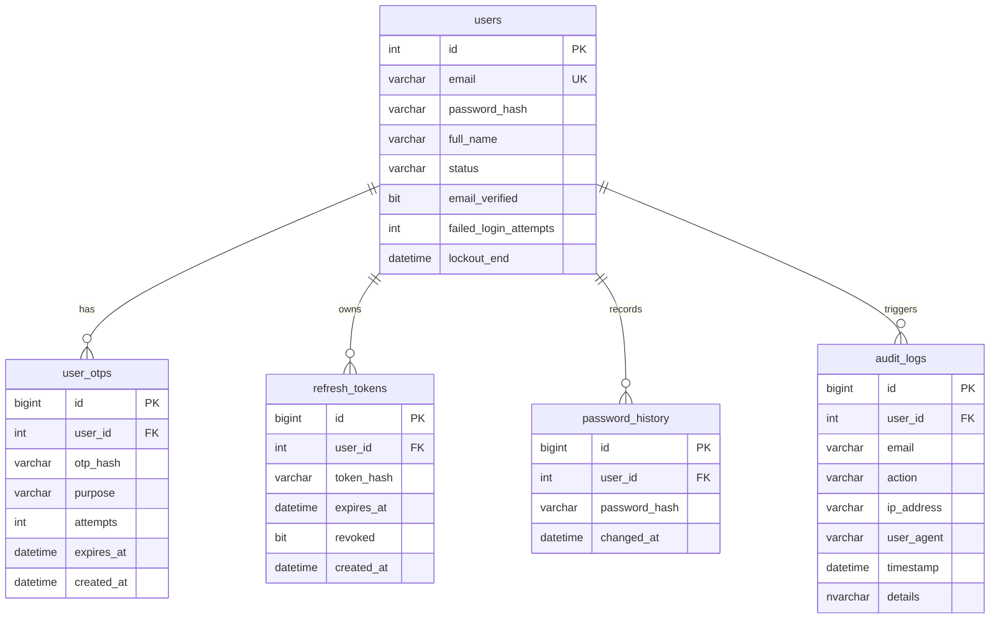

# Module 1: Authentication & Identity Management Redesign
**Author**: Senior Software Architect, Security Engineer, & Spring Boot Technical Lead  
**Date**: June 2026  
**Target Project**: GreenLife (swp391-su26-ai-audit-project-swp391_se20a04_group-05-3)

---

## A. Current State Assessment

The current Authentication & Identity Management module inside the `greenlife-backend` is an MVP (Minimum Viable Product) implementation using Spring Boot 3 + Spring Security + JWT:

1. **User Entity (`User.java`)**:
   * Contains basic profile columns (`fullName`, `email`, `passwordHash`, `phone`, `address`, `avatarUrl`, `status`, `emailVerified`).
   * Implements `UserDetails` for integration with Spring Security.
   * *Status field* is a plain string containing `"ACTIVE"` by default.
   * `emailVerified` is initialized to `false`, but is not checked in the authentication flow.

2. **Onboarding Flow**:
   * **Registration**: The `register` method in `AuthService` validates that the user requests either `CUSTOMER` or `STORE_OWNER` roles, checks if the email already exists, hashes the password via `BCrypt`, and immediately saves the user with status `"ACTIVE"`.
   * **Bypass of Verification**: Upon registration, the backend generates and returns a JWT token immediately. There is no email verification, verification OTP dispatch, or user activation step.
   * **Mock Bypass in Frontend**: The React client exposes an OTP interface but simulates verification entirely using a mock check for code `"123456"` or `"000000"`, bypassing the backend.

3. **Login Flow**:
   * Validates if the user's status is `"LOCKED"` (checking status string). If locked, it throws a Forbidden exception.
   * Executes authentication via Spring's `AuthenticationManager.authenticate(...)`.
   * Issues a single JWT token and returns user details.
   * *No security mechanisms* exist for locking accounts after multiple failed login attempts.

4. **JWT Security (`JwtService.java` & `JwtAuthenticationFilter.java`)**:
   * Uses a static secret key to sign HS256 tokens.
   * Expiration time is set to a long duration with no refresh token support.
   * No token revocation, blacklisting, or rotation mechanism exists. If a token is compromised, it remains valid until expiration.

---

## B. Target Architecture

The target architecture redesigns the authentication system into a secure, production-grade identity provider with multi-role support.

### 1. User Onboarding Flow
The redesigned registration flow implements verification steps before granting access to resource endpoints:



### 2. Account Status Lifecycle
To manage user access control securely, we establish four states:

1. **`PENDING_VERIFICATION`**: Assigned immediately upon registration. The user cannot log in or request resources. They can only call the `/api/auth/verify-otp` or `/api/auth/resend-otp` endpoints.
2. **`ACTIVE`**: User has validated their email. Full system capabilities matching their roles are unlocked.
3. **`LOCKED`**: Temporarily locked due to security thresholds (5 failed login attempts). Authentication is blocked for 30 minutes. It can be unlocked earlier via the password recovery flow.
4. **`DISABLED`**: Manually deactivated by an administrator for policy violations. Authentication is permanently blocked until manually re-enabled by an admin.

#### State Transition Diagram
```
              [Registration]
                    │
                    ▼
          ┌──────────────────────┐
          │ PENDING_VERIFICATION │
          └──────────┬───────────┘
                     │ (Verify OTP)
                     ▼
          ┌──────────────────────┐   (Disable)    ┌──────────┐
          │        ACTIVE        ├───────────────>│ DISABLED │
          └────┬───────────▲─────┘<───────────────┤          │
               │           │      (Enable/Admin)  └──────────┘
 (5 Failures)  │           │ (30min cooldown /
               ▼           │  Password Reset)
          ┌────┴───────────┴─────┐
          │        LOCKED        │
          └──────────────────────┘
```

### 3. Email Verification System
The email verification system secures OTP lifecycle management and prevents delivery spamming:
* **OTP Generation**: A 6-digit numeric string generated using `SecureRandom` to prevent predictability.
* **OTP Storage**: The OTP is hashed using SHA-256 before storage in the database to prevent database leakage exploits.
* **Expiration**: Hard expiration set to **5 minutes** from generation.
* **Resend Policy**: A strict **60-second cooldown** between resend requests. The system rejects verification code generation if an active code exists and has been issued within the last 60 seconds.
* **Max Attempts Block**: Maximum of **3 invalid OTP submissions**. If a user enters an incorrect OTP 3 times, the active OTP is deleted, and the user must request a new verification email.
* **Anti-Spam Strategy**: Limit OTP requests to a maximum of **5 requests per email address per hour** using token-bucket rate limiters (e.g., Bucket4j) on verification endpoints to prevent SMTP abuse.

### 4. Password Recovery System
The recovery flow validates identity using secure, multi-step transactions:
1. **Request Reset (`POST /api/auth/forgot-password`)**: Validates the email exists and the account is not `DISABLED`. Generates a 6-digit recovery OTP, hashes it, stores it in the database with a 5-minute expiry, and sends it via email.
2. **Verify OTP (`POST /api/auth/verify-recovery-otp`)**: Verifies the submitted OTP. On success, generates a short-lived (3-minute expiry), high-entropy "Password Reset Token" (UUIDv4) and returns it to the client.
3. **Complete Reset (`POST /api/auth/reset-password`)**: The client submits the new password alongside the Password Reset Token. The backend validates the token, hashes the new password, checks password history, updates the database, and invalidates the Password Reset Token.

### 5. Password Management
* **Change Password**: Authenticated users can change their password by providing their current password. The system verifies the current password hash before accepting the change.
* **Password History**: Prevents reuse of recently used passwords. The system stores the last **3 password hashes** in the `password_history` table. Password updates are validated against this history.
* **Password Strength Validation**: Rejects weak passwords. Enforces a regex rule validating:
  * Minimum **12 characters**.
  * At least one uppercase letter, one lowercase letter, one numeric digit, and one special character (`@$!%*?&`).
  * Validated against a list of common compromised passwords.

### 6. Session & Token Management (JWT Redesign)
Transition from a single long-lived JWT token to a secure, dual-token system (Access + Refresh Tokens):

1. **Access Token**:
   * Lifespan: **15 minutes**.
   * Payload: Contains user ID, email, roles, and functional permissions.
   * Delivery: Returned in the JSON response payload.
2. **Refresh Token**:
   * Lifespan: **7 days**.
   * Delivery: Transmitted to the client using a secure cookie: `HttpOnly`, `Secure` (requires HTTPS), `SameSite=Strict`. This mitigates Cross-Site Scripting (XSS) and Cross-Site Request Forgery (CSRF) vulnerabilities.
   * Storage: A SHA-256 hash of the Refresh Token is saved in the database associated with the user.
3. **Refresh Token Rotation (RTR)**:
   * When the client requests a new Access Token using their Refresh Token, the server validates the token, invalidates/deletes it, and issues **both** a new Access Token and a new Refresh Token.
   * **Replay & Theft Protection**: If a client attempts to reuse a previously rotated/revoked Refresh Token, the server detects token reuse, flags it as a breach, and immediately revokes all active refresh tokens for that user, terminating all active sessions.

### 7. User Profile Architecture
The database profile schema is redesigned to support onboarding verification states, lockout indicators, and security audits:

```
┌────────────────────────────────────────────────────────┐
│                        User                            │
├────────────────────────────────────────────────────────┤
│ - id: Integer (PK)                                     │
│ - fullName: String(120)                                │
│ - email: String(150) (Unique)                          │
│ - passwordHash: String(255)                            │
│ - phone: String(20)                                    │
│ - address: String(255)                                 │
│ - avatarUrl: String(500)                               │
│ - status: Enum (PENDING_VERIFICATION, ACTIVE, LOCKED)  │
│ - emailVerified: Boolean                               │
│ - failedLoginAttempts: Integer (Default: 0)            │
│ - lockoutEnd: LocalDateTime (Null or expiration)       │
│ - createdAt: LocalDateTime                             │
│ - updatedAt: LocalDateTime                             │
└────────────────────────────────────────────────────────┘
```

### 8. Audit Logging Schema
Security events must be logged for compliance and threat detection:
* **Log Table**: `audit_logs`
* **Logged Events**: `REGISTRATION`, `EMAIL_VERIFIED`, `LOGIN_SUCCESS`, `LOGIN_FAILURE`, `PASSWORD_RESET_REQUEST`, `PASSWORD_RESET_SUCCESS`, `ACCOUNT_LOCK`, `ROLE_CHANGE`.
* **Record Metadata**:
  * `id` (BIGINT, PK)
  * `user_id` (Integer, FK, Nullable to capture anonymous attempts)
  * `email` (String, records requested login emails)
  * `action` (String, event type)
  * `ip_address` (String, client IP)
  * `user_agent` (String, browser details)
  * `timestamp` (LocalDateTime)
  * `details` (NVARCHAR(MAX), audit metadata in JSON format)

---

## C. Database Design Proposal

To support this target architecture, the database schema requires the addition of security tracking tables, columns, constraints, and indexes.



### 1. Schema Extensions (SQL Server Dialect)

```sql
-- 1. Modify existing Users table to support brute force locking parameters
ALTER TABLE users ADD failed_login_attempts INT NOT NULL DEFAULT 0;
ALTER TABLE users ADD lockout_end DATETIME NULL;
GO

-- 2. Create User OTPs table
CREATE TABLE user_otps (
    id BIGINT IDENTITY(1,1) PRIMARY KEY,
    user_id INT NOT NULL,
    otp_hash VARCHAR(64) NOT NULL,
    purpose VARCHAR(30) NOT NULL, -- 'VERIFICATION', 'RECOVERY'
    attempts INT NOT NULL DEFAULT 0,
    expires_at DATETIME NOT NULL,
    created_at DATETIME NOT NULL DEFAULT GETDATE(),
    CONSTRAINT fk_otps_user FOREIGN KEY (user_id) REFERENCES users(id) ON DELETE CASCADE
);
CREATE INDEX idx_otps_user_purpose ON user_otps(user_id, purpose, expires_at);
GO

-- 3. Create Refresh Tokens table (RTR)
CREATE TABLE refresh_tokens (
    id BIGINT IDENTITY(1,1) PRIMARY KEY,
    user_id INT NOT NULL,
    token_hash VARCHAR(64) NOT NULL UNIQUE,
    expires_at DATETIME NOT NULL,
    revoked BIT NOT NULL DEFAULT 0,
    created_at DATETIME NOT NULL DEFAULT GETDATE(),
    CONSTRAINT fk_tokens_user FOREIGN KEY (user_id) REFERENCES users(id) ON DELETE CASCADE
);
CREATE INDEX idx_tokens_hash ON refresh_tokens(token_hash);
GO

-- 4. Create Password History table
CREATE TABLE password_history (
    id BIGINT IDENTITY(1,1) PRIMARY KEY,
    user_id INT NOT NULL,
    password_hash VARCHAR(255) NOT NULL,
    changed_at DATETIME NOT NULL DEFAULT GETDATE(),
    CONSTRAINT fk_history_user FOREIGN KEY (user_id) REFERENCES users(id) ON DELETE CASCADE
);
CREATE INDEX idx_history_user ON password_history(user_id);
GO

-- 5. Create Security Audit Logs table
CREATE TABLE audit_logs (
    id BIGINT IDENTITY(1,1) PRIMARY KEY,
    user_id INT NULL,
    email VARCHAR(150) NOT NULL,
    action VARCHAR(50) NOT NULL,
    ip_address VARCHAR(45) NOT NULL,
    user_agent VARCHAR(255) NOT NULL,
    timestamp DATETIME NOT NULL DEFAULT GETDATE(),
    details NVARCHAR(MAX) NULL, -- JSON string containing metadata
    CONSTRAINT fk_audit_user FOREIGN KEY (user_id) REFERENCES users(id) ON DELETE SET NULL
);
CREATE INDEX idx_audit_user_timestamp ON audit_logs(user_id, timestamp);
CREATE INDEX idx_audit_action ON audit_logs(action);
GO
```

---

## D. API Design Proposal

Below is the RESTful API design for the redesigned Authentication & Identity Management module:

### 1. API Endpoint Inventory

| HTTP Method | API URL Path | Auth Requirement | Request Body | Response Body |
| :--- | :--- | :--- | :--- | :--- |
| **POST** | `/api/auth/register` | Public (Anonymous) | `{ email, password, fullName, phone, address, role }` | `{ success: true, message: "Đăng ký thành công. Vui lòng xác thực email." }` |
| **POST** | `/api/auth/verify-otp` | Public (Anonymous) | `{ email, code }` | `{ success: true, message: "Email xác thực thành công. Bạn có thể đăng nhập." }` |
| **POST** | `/api/auth/resend-otp` | Public (Anonymous) | `{ email, purpose }` | `{ success: true, message: "Mã OTP mới đã được gửi." }` |
| **POST** | `/api/auth/login` | Public (Anonymous) | `{ email, password }` | `{ success: true, accessToken: "eyJhbG...", user: { id, fullName, email, role, status } }` *(Sets HttpOnly Refresh Cookie)* |
| **POST** | `/api/auth/refresh` | Public (Refresh Cookie)| *None (Reads Cookie)* | `{ success: true, accessToken: "eyJhbG..." }` *(Rotates HttpOnly Refresh Cookie)* |
| **POST** | `/api/auth/logout` | Authenticated | *None (Reads Cookie)* | `{ success: true, message: "Đăng xuất thành công." }` *(Clears Refresh Cookie)* |
| **POST** | `/api/auth/forgot-password`| Public (Anonymous) | `{ email }` | `{ success: true, message: "Mã khôi phục đã được gửi về email." }` |
| **POST** | `/api/auth/verify-recovery`| Public (Anonymous) | `{ email, code }` | `{ success: true, resetToken: "4aef4f37-..." }` |
| **POST** | `/api/auth/reset-password` | Public (Anonymous) | `{ email, token, newPassword }` | `{ success: true, message: "Mật khẩu đã được cập nhật thành công." }` |
| **POST** | `/api/auth/change-password`| Authenticated | `{ oldPassword, newPassword }` | `{ success: true, message: "Đổi mật khẩu thành công." }` |
| **GET** | `/api/auth/me` | Authenticated | *None* | `{ id, fullName, email, phone, address, role, emailVerified, status }` |

### 2. Payload Schema Details

#### POST `/api/auth/login` Response Headers
```http
Set-Cookie: refresh_token=abc123xyz...; Max-Age=604800; Path=/api/auth; HttpOnly; Secure; SameSite=Strict
```

#### POST `/api/auth/verify-recovery` Response
```json
{
  "success": true,
  "resetToken": "81c5cc76-1d82-4bb6-94c0-af22d8442fd8"
}
```

---

## E. Security Review

The current Spring Boot MVP implementation has several design weaknesses that must be addressed:

### 1. Critical Issues
* **Bypassable Email Verification**: Registered accounts default to `"ACTIVE"`. While the database includes an `emailVerified` column, the backend does not enforce this check during authentication. This allows unverified accounts to access the system.
* **No Token Revocation**: JWT tokens are signed using a symmetric key and validated solely by expiration time. If a user logs out, their token remains active until it naturally expires.
* **Mock Bypass Exposed in Production**: The frontend includes hardcoded checks (`code === "123456"`) that bypass OTP validation. If these configurations remain in place, they present a significant security vulnerability.

### 2. High Priority Improvements
* **Brute-Force Vulnerability**: The authentication endpoint does not track failed login attempts or enforce account lockouts. This exposes the system to automated credential stuffing and brute-force attacks.
* **Missing Refresh Token Rotation**: The absence of token rotation and revocation makes the system vulnerable to token theft. A stolen long-lived token could grant unauthorized access indefinitely.
* **Security Context Role Prefix Mismatches**: Path permissions check for specific role strings (e.g. `STORE_OWNER`). However, Spring Security requires roles loaded from database authorities to be prefixed with `ROLE_` to match `.hasRole(...)` expressions. This configuration discrepancy must be resolved to prevent access errors.

### 3. Medium Priority Improvements
* **Symmetric Secret Key In Production**: The JWT signing key is stored as a hardcoded static string in the code rather than loaded from secure system environments (`application.properties`).
* **Weak Password Standard**: There is no server-side validation enforcing password complexity (length, symbols, casing), which allows weak passwords.

---

## F. Detailed Implementation Roadmap

This roadmap details the implementation steps for the redesigned authentication system:

```
┌───────────────────────────┐
│  Step 1: Database Setup   │ ◄── Alter tables, create OTP, Token, and Audit tables
└─────────────┬─────────────┘
              ▼
┌───────────────────────────┐
│  Step 2: Service Layer    │ ◄── Implement Email Dispatch, OTP generation, and Audit logging
└─────────────┬─────────────┘
              ▼
┌───────────────────────────┐
│  Step 3: Signup Flows     │ ◄── Update registration flow, implement OTP verification
└─────────────┬─────────────┘
              ▼
┌───────────────────────────┐
│  Step 4: Token Redesign   │ ◄── Implement Access/Refresh tokens & Rotation cookie (RTR)
└─────────────┬─────────────┘
              ▼
┌───────────────────────────┐
│  Step 5: Access Recovery  │ ◄── Implement Forgot/Reset password flow, enforce history
└─────────────┬─────────────┘
              ▼
┌───────────────────────────┐
│  Step 6: Bruteforce/Audit │ ◄── Add login failure tracking, automatic lockout, and audits
└─────────────┬─────────────┘
              ▼
┌───────────────────────────┐
│  Step 7: Verification     │ ◄── Run security tests and verify integration
└───────────────────────────┘
```

### Step 1: Database Schema Deployment
1. Execute the SQL migration script to add `failed_login_attempts` and `lockout_end` to the `users` table.
2. Create tables: `user_otps`, `refresh_tokens`, `password_history`, and `audit_logs`.
3. Add foreign key constraints and database indexes.
4. Regenerate JPA Entity classes in Spring Boot (`UserOtp`, `RefreshToken`, `PasswordHistory`, `AuditLog`) and bind relationships.

### Step 2: Infrastructure Service Deployment
1. **Email Service (`EmailService.java`)**: Create an interface and implementation using `JavaMailSender` to dispatch HTML-formatted OTP codes.
2. **OTP Service (`OtpService.java`)**: Implement secure OTP generation using `SecureRandom`, hashing, validation, rate-limiting rules, and retry policies.
3. **Audit Log Service (`AuditLogService.java`)**: Implement asynchronous logging to record security events in the `audit_logs` table without blocking user requests.

### Step 3: Registration & Account Verification
1. Update `AuthService.register(...)` to save new users with status `PENDING_VERIFICATION`.
2. Implement code dispatching the verification OTP during registration.
3. Expose `POST /api/auth/verify-otp` to validate the OTP and activate accounts.
4. Expose `POST /api/auth/resend-otp` with rate limits enforced.

### Step 4: Session & Token Management (RTR)
1. Redesign `JwtService` to issue access tokens with a 15-minute expiration.
2. Implement refresh token generation, hashing, and database verification.
3. Update `AuthController` to return access tokens in the response payload and set refresh tokens in secure HttpOnly cookies.
4. Implement the `/api/auth/refresh` endpoint to support Refresh Token Rotation (RTR) and token theft detection.

### Step 5: Password Recovery & Management
1. Expose `POST /api/auth/forgot-password` to generate and send recovery OTPs.
2. Expose `POST /api/auth/verify-recovery` to validate OTPs and issue short-lived Password Reset Tokens.
3. Expose `POST /api/auth/reset-password` to update passwords, enforcing complexity rules and history checks.
4. Expose `POST /api/auth/change-password` for authenticated users.

### Step 6: Lockout Rules & Auditing Integration
1. Implement a login listener to track authentication failures.
2. Enforce lockout rules: lock accounts for 30 minutes after 5 consecutive failures.
3. Integrate the audit logging system across registration, login, lockout, and password change operations.

### Step 7: Testing & Integration
1. Write integration tests for token rotation, email validation, and lockout rules.
2. Align frontend services to consume the new REST endpoints.
3. Deactivate mock bypass checks (`123456`) in the frontend codebase.
