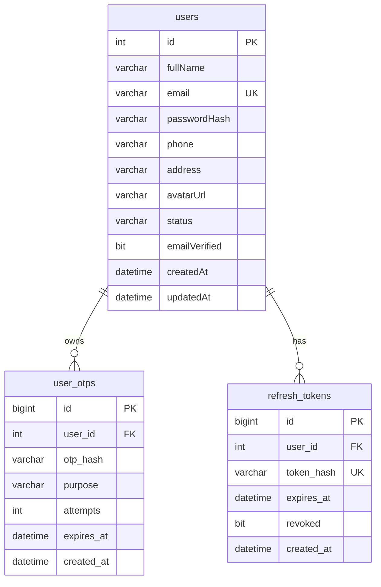

# Module 1A: Authentication Core Implementation Specification
**Author**: Senior Spring Boot Architect, Security Engineer, & Database Designer  
**Date**: June 2026  
**Target Project**: GreenLife (swp391-su26-ai-audit-project-swp391_se20a04_group-05-3)

This document serves as the implementation specification for **Module 1A - Authentication Core**. It details the business logic, database structure, JPA mappings, package design, DTOs, API contracts, security configurations, and checklists required to implement this module.

---

## PART 1 — BUSINESS FLOW DESIGN

This section defines the core transactional workflows for user registration, verification, authentication, session maintenance, and de-authentication.

### 1. Registration Flow

#### Preconditions
* The requested email must not already exist in the database.
* The registration payload must pass validation constraints.
* The requested role must be either `CUSTOMER` or `STORE_OWNER`.

#### Validation Rules
* **Email**: Valid syntax, non-blank, max 150 characters.
* **Password**: Minimum 12 characters, at least 1 uppercase letter, 1 lowercase letter, 1 number, and 1 special character.
* **Full Name**: Non-blank, max 120 characters.
* **Phone**: Optional, max 20 characters, must match local phone format.

#### Success Path
1. The client sends a registration request to `POST /api/auth/register`.
2. The system hashes the password using `BCrypt`.
3. The system saves a new `User` record with `status = PENDING_VERIFICATION` and `email_verified = false`.
4. The system generates a cryptographically secure 6-digit OTP code.
5. The system hashes the OTP using SHA-256 and saves it in the `user_otps` table with a 5-minute expiration timestamp and `purpose = VERIFICATION`.
6. The system dispatches the plaintext OTP code to the user's email address asynchronously.
7. The system returns an HTTP 201 Created status containing a success message.

#### Failure Scenarios
* **Email Conflict**: If the email is registered, the system returns HTTP 400 Bad Request: `"Email đã được sử dụng bởi tài khoản khác"`.
* **Invalid Input**: If any field violates validation constraints, the system returns HTTP 400 Bad Request with field-specific errors.
* **Disallowed Role**: If the requested role is not `CUSTOMER` or `STORE_OWNER` (e.g., trying to register as `ADMIN`), the system returns HTTP 403 Forbidden.

---

### 2. OTP Verification Flow

#### Preconditions
* The user account exists and has a status of `PENDING_VERIFICATION`.
* An active OTP record exists in the database.

#### Success Path
1. The user submits their email and plaintext OTP code to `POST /api/auth/verify-otp`.
2. The system hashes the submitted OTP and queries the database for a matching record.
3. The system verifies that the OTP is not expired and that the retry count has not been exceeded.
4. The system updates the user's status to `ACTIVE` and sets `email_verified = true`.
5. The system deletes all active OTP records for the user from `user_otps`.
6. The system returns HTTP 200 OK.

#### Failure Scenarios
* **Expired OTP**: If `expires_at` is in the past, the system deletes the OTP and returns HTTP 410 Gone: `"Mã OTP đã hết hạn. Vui lòng yêu cầu gửi lại mã."`.
* **Invalid OTP**: If the hashes do not match, the system increments the `attempts` counter in `user_otps`.
  * If `attempts < 3`, it returns HTTP 400 Bad Request: `"Mã OTP không hợp lệ. Bạn còn {3 - attempts} lần thử."`.
  * If `attempts >= 3`, the system deletes the OTP record and returns HTTP 400 Bad Request: `"Bạn đã nhập sai quá 3 lần. Vui lòng yêu cầu mã OTP mới."`.

---

### 3. Login Flow

#### Preconditions
* The user exists in the database.
* The account status is `ACTIVE`.

#### Success Path
1. The client submits credentials to `POST /api/auth/login`.
2. The Spring security layer matches the password against the stored BCrypt hash.
3. The system validates that the account status is `ACTIVE`.
4. The system issues a short-lived JWT Access Token (15 minutes).
5. The system generates a secure, cryptographically random Refresh Token (UUIDv4).
6. The system saves the SHA-256 hash of the Refresh Token in the database.
7. The system sets the plaintext Refresh Token in an HttpOnly, Secure cookie.
8. The system returns HTTP 200 OK containing the Access Token and user details.

#### Failure Scenarios
* **Pending Status**: If the user exists but has status `PENDING_VERIFICATION`, the login attempt is blocked, and the system returns HTTP 403 Forbidden: `"Tài khoản chưa được xác thực email. Vui lòng hoàn tất xác thực."`.
* **Disabled Status**: If status is `DISABLED`, the system returns HTTP 403 Forbidden: `"Tài khoản đã bị vô hiệu hóa. Vui lòng liên hệ quản trị viên."`.
* **Bad Credentials**: If the username or password is incorrect, the system returns HTTP 401 Unauthorized: `"Email hoặc mật khẩu không chính xác"`.

---

### 4. Refresh Flow (Refresh Token Rotation - RTR)

#### Preconditions
* The client sends a request to `POST /api/auth/refresh` containing a `refresh_token` cookie.
* The Refresh Token hash exists in the database and is marked as active (`revoked = false`).

#### Success Path
1. The system reads the Refresh Token from the HTTP cookie.
2. The system hashes the token and queries `refresh_tokens`.
3. The system verifies that the token is not expired and has not been revoked.
4. The system generates a new Access Token.
5. The system generates a new Refresh Token, deletes/revokes the old token, and persists the hash of the new token.
6. The system updates the HTTP cookie with the new Refresh Token.
7. The system returns HTTP 200 OK containing the new Access Token.

#### Theft Detection & Failure Scenarios
* **Replay Attack / Theft**: If the submitted Refresh Token is found in the database but is already marked as `revoked = true`, the system assumes a token theft attempt has occurred.
  * **Action**: The system immediately revokes all active refresh tokens for the associated user, invalidating all their active sessions. It returns HTTP 401 Unauthorized: `"Phiên làm việc hết hạn hoặc bị xâm nhập. Vui lòng đăng nhập lại."`.
* **Expired Token**: If the token is expired, the system deletes it from the database and returns HTTP 401 Unauthorized: `"Phiên làm việc đã hết hạn. Vui lòng đăng nhập lại."`.

---

### 5. Logout Flow

#### Preconditions
* The request contains a valid `refresh_token` cookie.

#### Success Path
1. The client submits a request to `POST /api/auth/logout`.
2. The system extracts the Refresh Token from the cookie.
3. The system hashes the token and deletes it from the database.
4. The system overwrites the cookie in the HTTP response headers, setting its value to null and `Max-Age = 0`.
5. The system returns HTTP 200 OK.

---

## PART 2 — DATABASE DESIGN REVIEW

This section reviews the database schema updates required to support Module 1A.



### 1. `users` Table Schema

| Column Name | Data Type | Nullable | Default | Constraints / Indexes |
| :--- | :--- | :---: | :--- | :--- |
| `id` | `INT` | No | `IDENTITY(1,1)` | `PRIMARY KEY` (Clustered) |
| `full_name` | `VARCHAR(120)` | No | None | None |
| `email` | `VARCHAR(150)` | No | None | `UNIQUE CONSTRAINT`, `INDEX` (Non-Clustered) |
| `password_hash` | `VARCHAR(255)` | No | None | None |
| `phone` | `VARCHAR(20)` | Yes | `NULL` | None |
| `address` | `VARCHAR(255)` | Yes | `NULL` | None |
| `avatar_url` | `VARCHAR(500)` | Yes | `NULL` | None |
| `role_id` | `INT` | No | None | `FOREIGN KEY` references `roles(id)` |
| `status` | `VARCHAR(30)` | No | `'PENDING_VERIFICATION'` | `CHECK CONSTRAINT` (Values: 'PENDING_VERIFICATION', 'ACTIVE', 'LOCKED', 'DISABLED') |
| `email_verified`| `BIT` | No | `0` | None |
| `created_at` | `DATETIME` | No | `GETDATE()` | None |
| `updated_at` | `DATETIME` | Yes | `NULL` | None |

### 2. `user_otps` Table Schema

| Column Name | Data Type | Nullable | Default | Constraints / Indexes |
| :--- | :--- | :---: | :--- | :--- |
| `id` | `BIGINT` | No | `IDENTITY(1,1)` | `PRIMARY KEY` |
| `user_id` | `INT` | No | None | `FOREIGN KEY` references `users(id)` ON DELETE CASCADE |
| `otp_hash` | `VARCHAR(64)` | No | None | None |
| `purpose` | `VARCHAR(30)` | No | None | `CHECK CONSTRAINT` (Value must be: 'VERIFICATION') |
| `attempts` | `INT` | No | `0` | None |
| `expires_at` | `DATETIME` | No | None | None |
| `created_at` | `DATETIME` | No | `GETDATE()` | None |

* **Index**: Composite index `idx_otps_lookup` on `(user_id, purpose, expires_at)`.

### 3. `refresh_tokens` Table Schema

| Column Name | Data Type | Nullable | Default | Constraints / Indexes |
| :--- | :--- | :---: | :--- | :--- |
| `id` | `BIGINT` | No | `IDENTITY(1,1)` | `PRIMARY KEY` |
| `user_id` | `INT` | No | None | `FOREIGN KEY` references `users(id)` ON DELETE CASCADE |
| `token_hash` | `VARCHAR(64)` | No | None | `UNIQUE CONSTRAINT`, `INDEX` (Non-Clustered) |
| `expires_at` | `DATETIME` | No | None | None |
| `revoked` | `BIT` | No | `0` | None |
| `created_at` | `DATETIME` | No | `GETDATE()` | None |

* **Index**: Non-clustered index on `token_hash`.

---

## PART 3 — JPA ENTITY DESIGN

This section outlines the metadata definitions, validations, and associations required for the JPA entities.

### 1. `User` Entity

* **Mapping**: Class annotated with `@Entity` and `@Table(name = "users")`.
* **Fields**:
  * `id`: Annotated with `@Id`, `@GeneratedValue(strategy = GenerationType.IDENTITY)`.
  * `fullName`: String, non-nullable.
  * `email`: String, unique, non-nullable.
  * `passwordHash`: String, mapped to column `password_hash`.
  * `phone`: String, nullable.
  * `address`: String, nullable.
  * `avatarUrl`: String, mapped to column `avatar_url`, nullable.
  * `role`: Many-to-One relationship mapped to `Role` entity, Eager fetched.
  * `status`: Mapped to Enum status value, persisted as `EnumType.STRING`.
  * `emailVerified`: Mapped to column `email_verified`, primitive boolean.
  * `createdAt`: Mapped to `created_at`, initialized on persist.
  * `updatedAt`: Mapped to `updated_at`, updated on modify.
* **Validations**:
  * Email must match `@Email` format constraint.
  * Names cannot be blank (`@NotBlank`).
* **Security Methods**: Extends `UserDetails`.
  * `getAuthorities()`: Appends prefix `ROLE_` to `role.getName()` and returns it as a list of `SimpleGrantedAuthority`.
  * `isEnabled()`: Returns true if `status == ACTIVE`.

### 2. `UserOtp` Entity

* **Mapping**: Annotated with `@Entity` and `@Table(name = "user_otps")`.
* **Fields**:
  * `id`: `@Id`, `@GeneratedValue(strategy = GenerationType.IDENTITY)`.
  * `user`: Many-to-One relationship mapped to `User`, Lazy fetched, `@JoinColumn(name = "user_id", nullable = false)`.
  * `otpHash`: String, mapped to `otp_hash`, non-nullable.
  * `purpose`: String/Enum, mapped to `purpose` column.
  * `attempts`: Primitive integer.
  * `expiresAt`: `LocalDateTime`, non-nullable.
  * `createdAt`: `LocalDateTime`, non-nullable.
* **Lifecycle**:
  * `@PrePersist`: Set `attempts = 0` and `createdAt = LocalDateTime.now()`.

### 3. `RefreshToken` Entity

* **Mapping**: Annotated with `@Entity` and `@Table(name = "refresh_tokens")`.
* **Fields**:
  * `id`: `@Id`, `@GeneratedValue(strategy = GenerationType.IDENTITY)`.
  * `user`: Many-to-One relationship mapped to `User`, Lazy fetched, `@JoinColumn(name = "user_id", nullable = false)`.
  * `tokenHash`: String, unique, non-nullable.
  * `expiresAt`: `LocalDateTime`, non-nullable.
  * `revoked`: Boolean, mapped to column `revoked`.
  * `createdAt`: `LocalDateTime`, non-nullable.
* **Lifecycle**:
  * `@PrePersist`: Set `revoked = false` and `createdAt = LocalDateTime.now()`.

---

## PART 4 — PACKAGE STRUCTURE

To ensure clean separation of concerns, the backend packages under `com.greenlife` are structured as follows:

```
com.greenlife
├── config       (Global configurations: CORS, security beans, mail sender setup)
├── security     (Security logic: JWT interceptor, authentication entry points)
├── controller   (Web Rest Controllers handling raw HTTP requests)
├── service      (Core transactional business services and email dispatchers)
├── repository   (JPA interfaces wrapping database access layers)
├── entity       (Data models mapping database tables)
├── dto          (Data Transfer Objects for validation and serialization)
├── mapper       (Converters transforming Entities to DTOs and vice-versa)
├── exception    (Global error handlers and custom runtime exceptions)
└── util         (Helper utilities: cryptographic randoms and hash generators)
```

### Package Responsibilities
* **`config`**: Configures Spring Boot integrations (e.g. configuring `JavaMailSender` beans or enabling caching frameworks).
* **`security`**: Contains classes that integrate with Spring Security filter chains, parse JWT tokens, and manage authentication state.
* **`controller`**: Handles incoming HTTP requests, validates incoming DTO request bodies, and maps output models to HTTP responses.
* **`service`**: Implements business rules, manages database transactions, coordinates third-party services (like SMTP), and throws custom exceptions.
* **`repository`**: Exposes CRUD queries and custom JPQL database operations.
* **`entity`**: Encapsulates entity state, database mapping configurations, and JPA lifecycle hooks.
* **`dto`**: Defines request and response contracts, and enforces constraint validation.
* **`mapper`**: Isolates translation logic to convert database entities to clean response objects, avoiding leakage of sensitive columns (such as password hashes) to the client.
* **`exception`**: Maps custom exceptions to user-friendly JSON payloads and HTTP status codes.
* **`util`**: Provides standalone helper utilities, such as random generators or string helpers.

---

## PART 5 — DTO DESIGN

All requested payloads enforce input validation constraints before processing.

### 1. Registration DTO (`RegisterRequest`)
* **Fields**:
  * `fullName`: String (NotBlank, size 2 to 120)
  * `email`: String (NotBlank, Email, size max 150)
  * `password`: String (NotBlank, size 12 to 64)
  * `phone`: String (Pattern matching local format, optional)
  * `address`: String (Optional, size max 255)
  * `role`: String (NotBlank, must be "CUSTOMER" or "STORE_OWNER")
* **Example Payload**:
```json
{
  "fullName": "Nguyen Van A",
  "email": "vana@greenlife.vn",
  "password": "Password123!@",
  "phone": "0905123456",
  "address": "123 Le Loi, Da Nang",
  "role": "CUSTOMER"
}
```

### 2. OTP Verification DTO (`VerifyOtpRequest`)
* **Fields**:
  * `email`: String (NotBlank, Email)
  * `code`: String (NotBlank, Pattern checking 6 digits: `^\\d{6}$`)
* **Example Payload**:
```json
{
  "email": "vana@greenlife.vn",
  "code": "582914"
}
```

### 3. Login DTO (`LoginRequest`)
* **Fields**:
  * `email`: String (NotBlank, Email)
  * `password`: String (NotBlank)
* **Example Payload**:
```json
{
  "email": "vana@greenlife.vn",
  "password": "Password123!@"
}
```

### 4. Refresh DTO
* *No Request DTO required*. The Refresh Token is read directly from the HttpOnly HTTP Cookie.

### 5. Auth Response DTO (`AuthResponse`)
* **Fields**:
  * `accessToken`: String
  * `user`: UserResponse
* **Example Payload**:
```json
{
  "accessToken": "eyJhbGciOiJIUzI1NiIsIn...",
  "user": {
    "id": 15,
    "fullName": "Nguyen Van A",
    "email": "vana@greenlife.vn",
    "phone": "0905123456",
    "address": "123 Le Loi, Da Nang",
    "role": "CUSTOMER",
    "emailVerified": true,
    "status": "ACTIVE"
  }
}
```

### 6. User Response DTO (`UserResponse`)
* **Fields**:
  * `id`: Integer
  * `fullName`: String
  * `email`: String
  * `phone`: String
  * `address`: String
  * `role`: String
  * `emailVerified`: Boolean
  * `status`: String
* **Example Payload**:
```json
{
  "id": 15,
  "fullName": "Nguyen Van A",
  "email": "vana@greenlife.vn",
  "phone": "0905123456",
  "address": "123 Le Loi, Da Nang",
  "role": "CUSTOMER",
  "emailVerified": true,
  "status": "ACTIVE"
}
```

---

## PART 6 — API CONTRACT DESIGN

REST endpoints expose API contracts with validation handling.

### 1. `POST /api/auth/register`
* **Auth Requirement**: Public
* **Request Payload**: `RegisterRequest` (JSON)
* **Response Status**: `201 Created`
* **Success JSON Response**:
```json
{
  "success": true,
  "message": "Đăng ký thành công. Vui lòng xác thực mã OTP đã được gửi tới email."
}
```
* **Error Scenarios**:
  * HTTP 400 Bad Request (Email already exists):
  ```json
  {
    "success": false,
    "error": "BAD_REQUEST",
    "message": "Email đã được sử dụng bởi tài khoản khác"
  }
  ```

---

### 2. `POST /api/auth/verify-otp`
* **Auth Requirement**: Public
* **Request Payload**: `VerifyOtpRequest` (JSON)
* **Response Status**: `200 OK`
* **Success JSON Response**:
```json
{
  "success": true,
  "message": "Xác thực tài khoản thành công. Bạn có thể đăng nhập."
}
```
* **Error Scenarios**:
  * HTTP 400 Bad Request (Incorrect OTP):
  ```json
  {
    "success": false,
    "error": "BAD_REQUEST",
    "message": "Mã OTP không hợp lệ. Bạn còn 2 lần thử."
  }
  ```
  * HTTP 410 Gone (OTP expired):
  ```json
  {
    "success": false,
    "error": "GONE",
    "message": "Mã OTP đã hết hạn. Vui lòng yêu cầu gửi lại mã."
  }
  ```

---

### 3. `POST /api/auth/resend-otp`
* **Auth Requirement**: Public
* **Request Payload**:
```json
{
  "email": "vana@greenlife.vn",
  "purpose": "VERIFICATION"
}
```
* **Response Status**: `200 OK`
* **Success JSON Response**:
```json
{
  "success": true,
  "message": "Mã OTP mới đã được gửi về email."
}
```
* **Error Scenarios**:
  * HTTP 429 Too Many Requests (Cooldown active):
  ```json
  {
    "success": false,
    "error": "TOO_MANY_REQUESTS",
    "message": "Vui lòng đợi 60 giây trước khi yêu cầu gửi lại mã."
  }
  ```

---

### 4. `POST /api/auth/login`
* **Auth Requirement**: Public
* **Request Payload**: `LoginRequest` (JSON)
* **Response Status**: `200 OK` (Sets cookie `refresh_token`)
* **Success JSON Response**:
```json
{
  "accessToken": "eyJhbGciOiJIUzI1NiIsIn...",
  "user": {
    "id": 15,
    "fullName": "Nguyen Van A",
    "email": "vana@greenlife.vn",
    "phone": "0905123456",
    "address": "123 Le Loi, Da Nang",
    "role": "CUSTOMER",
    "emailVerified": true,
    "status": "ACTIVE"
  }
}
```
* **Error Scenarios**:
  * HTTP 403 Forbidden (Email not verified):
  ```json
  {
    "success": false,
    "error": "FORBIDDEN",
    "message": "Tài khoản chưa được xác thực email. Vui lòng hoàn tất xác thực."
  }
  ```
  * HTTP 401 Unauthorized (Wrong password):
  ```json
  {
    "success": false,
    "error": "UNAUTHORIZED",
    "message": "Email hoặc mật khẩu không chính xác"
  }
  ```

---

### 5. `POST /api/auth/refresh`
* **Auth Requirement**: Public (Cookie token validated)
* **Request Payload**: None (Reads `refresh_token` HTTP Cookie)
* **Response Status**: `200 OK` (Rotates cookie `refresh_token`)
* **Success JSON Response**:
```json
{
  "accessToken": "eyJhbGciOiJIUzI1NiIsIn..."
}
```
* **Error Scenarios**:
  * HTTP 401 Unauthorized (Expired or revoked refresh token):
  ```json
  {
    "success": false,
    "error": "UNAUTHORIZED",
    "message": "Phiên làm việc hết hạn hoặc bị xâm nhập. Vui lòng đăng nhập lại."
  }
  ```

---

### 6. `POST /api/auth/logout`
* **Auth Requirement**: Authenticated
* **Request Payload**: None
* **Response Status**: `200 OK` (Clears Cookie)
* **Success JSON Response**:
```json
{
  "success": true,
  "message": "Đăng xuất thành công."
}
```

---

### 7. `GET /api/auth/me`
* **Auth Requirement**: Authenticated (Requires Bearer Header: `Authorization: Bearer <accessToken>`)
* **Request Payload**: None
* **Response Status**: `200 OK`
* **Success JSON Response**:
```json
{
  "id": 15,
  "fullName": "Nguyen Van A",
  "email": "vana@greenlife.vn",
  "phone": "0905123456",
  "address": "123 Le Loi, Da Nang",
  "role": "CUSTOMER",
  "emailVerified": true,
  "status": "ACTIVE"
}
```

---

## PART 7 — SECURITY DESIGN

This section defines the security measures enforced to safeguard the authentication system.

### 1. JWT Strategy
* **Symmetric HMAC-SHA256 Signing**: Access tokens are signed using a secure secret key.
* **Access Token Lifespan**: **15 minutes**.
* **Refresh Token Lifespan**: **7 days** (604,800 seconds).
* **Claims Design**:
  * `sub`: Email address of the user.
  * `userId`: Mapped primary key identifier.
  * `role`: User role name string (e.g., `CUSTOMER`).
  * `iat`: Issued-at epoch timestamp.
  * `exp`: Expiration epoch timestamp.

### 2. OTP Security
* **Generation**: Generates a 6-digit number using `java.security.SecureRandom`.
* **Storage Hashing**: Before persisting to `user_otps`, the system hashes the generated OTP string:
  $$\text{otp\_hash} = \text{SHA-256}(\text{otp\_code} + \text{salt})$$
  *(The user ID can act as the salt to prevent precomputed table lookup attacks).*
* **Cleanup Routine**: A scheduled cron job runs hourly to delete expired OTPs from the database.

### 3. Cookie Security
To secure Refresh Tokens against CSRF and XSS attacks, the `Set-Cookie` header must configure the following security attributes:
* **HttpOnly**: Script access (e.g., `document.cookie`) is disabled.
* **Secure**: Restricts token transmission to encrypted HTTPS requests only.
* **SameSite = Strict**: Prevents cookie transmission in cross-site requests, mitigating CSRF risks.
* **Path**: Restricted to `/api/auth/refresh` and `/api/auth/logout` routes.

### 4. Secret Management
Never store security keys, database credentials, or API secret codes in plaintext within configuration files.
* **Externalized Configuration**:
  ```yaml
  greenlife:
    jwt:
      secret: ${JWT_SECRET_KEY}
      access-expiration: 900000 # 15 minutes
    otp:
      expiration-minutes: 5
  ```
* **Environment Variables**: Configure the system production runtime (Docker Compose, Kubernetes, or Host System) to supply the variables (e.g., `JWT_SECRET_KEY`) dynamically.
* **Mail Server Properties**: Store SMTP credentials in environment variables:
  ```properties
  spring.mail.password=${SMTP_SERVER_PASSWORD}
  ```

---

## PART 8 — IMPLEMENTATION CHECKLIST

This checklist outlines the step-by-step tasks to implement Module 1A:

### Step 1 — Database Migration
* **Dependencies**: SQL Server connection active.
* **Tasks**:
  * Execute schema DDL scripts to alter `users` status validation values.
  * Create `user_otps` and `refresh_tokens` tables.
  * Configure foreign key constraints and lookup indexes.
* **Outputs**: Database tables matching Part 2.
* **Verification Criteria**: Run `sp_help 'user_otps'` and verify indexes are created.

### Step 2 — JPA Entities Mapping
* **Dependencies**: Step 1 complete.
* **Tasks**:
  * Implement `UserOtp` and `RefreshToken` entities with mapping annotations.
  * Configure lazy fetch strategies and lifecycle hooks.
  * Update `User` entity to map authorities with `ROLE_` prefixes.
* **Outputs**: Java classes under `com.greenlife.entity`.
* **Verification Criteria**: App boots successfully without JPA mapping errors.

### Step 3 — Repository Interface Creation
* **Dependencies**: Step 2 complete.
* **Tasks**:
  * Create `UserOtpRepository` exposing lookup and cleanup queries.
  * Create `RefreshTokenRepository` exposing token verification and revocation operations.
* **Outputs**: Java files under `com.greenlife.repository`.
* **Verification Criteria**: Compilation success.

### Step 4 — Email Service Integration
* **Dependencies**: Spring Mail dependency imported.
* **Tasks**:
  * Implement `EmailService` using `JavaMailSender`.
  * Create HTML templates for OTP verification emails.
* **Outputs**: Mail dispatch class under `com.greenlife.service`.
* **Verification Criteria**: Unit test sending a dummy email to a test box succeeds.

### Step 5 — OTP Core Service Logic
* **Dependencies**: Step 3 and 4 complete.
* **Tasks**:
  * Implement `OtpService` containing OTP generation, hashing, and expiration checks.
  * Add verification retry limit tracking.
* **Outputs**: `OtpService.java` in package `com.greenlife.service`.
* **Verification Criteria**: Unit test validates that OTP is hashed, validates correctly, and expires in 5 minutes.

### Step 6 — Registration Flow Update
* **Dependencies**: Step 5 complete.
* **Tasks**:
  * Update `AuthService.register()` to save users as `PENDING_VERIFICATION`.
  * Trigger OTP generation and email dispatch upon registration.
  * Implement `verifyOtp` and `resendOtp` logic.
* **Outputs**: Modified `AuthService.java` and new DTO mappings.
* **Verification Criteria**: Registering a user successfully inserts a record with status `PENDING_VERIFICATION` and sends an email.

### Step 7 — Session & Refresh Token Rotation (RTR)
* **Dependencies**: Step 6 complete.
* **Tasks**:
  * Update `JwtService` to configure short access lifetimes.
  * Create token rotation and revocation logic in `RefreshTokenService`.
  * Configure cookies in `AuthController` for HTTP requests.
* **Outputs**: Refresh endpoint mapping in `AuthController.java`.
* **Verification Criteria**: Logging in sets the HttpOnly cookie. Requesting `/refresh` returns a new access token and rotates the cookie.

---

## PART 9 — DEFINITION OF DONE

The implementation of Module 1A is considered complete when the following criteria are met:

### 1. Functional Criteria
* Users can register, but cannot log in until their email is verified.
* Accounts are activated when the correct OTP is submitted.
* Users can log out, which deletes the Refresh Token database entry and clears client cookies.

### 2. Security Criteria
* Plaintext passwords are not saved in the database (hashed using BCrypt).
* Plaintext OTP codes and Refresh Tokens are not saved in the database (stored as SHA-256 hashes).
* Refresh Tokens are accessible only via HttpOnly, Secure, and SameSite=Strict cookies.
* Access tokens expire in 15 minutes, and refresh tokens expire in 7 days.
* OTP resend attempts are restricted by rate limits.

### 3. Database Criteria
* All foreign key constraints and lookup indexes match the schema definition.
* Cascading deletes are configured on database entities.

### 4. API Criteria
* API requests return appropriate HTTP status codes (201, 200, 400, 401, 403, 429).
* API responses do not expose sensitive user data (such as password hashes).

### 5. Testing Criteria
* Unit tests achieve a minimum of **80% code coverage** for service classes (`AuthService`, `OtpService`, `RefreshTokenService`).
* Integration tests verify:
  * Successful registration to activation flow.
  * OTP retry threshold locking.
  * Cookie rotation and theft recovery.
